# RippleFlow 用户手册

## 文档信息

| 项目 | 内容 |
|------|------|
| 版本 | v0.5 |
| 日期 | 2026-03-02 |
| 适用对象 | 创业软件开发团队成员 |

---

## 目录

1. [系统概述](#一系统概述)
2. [设计理念](#二设计理念)
3. [核心功能](#三核心功能)
4. [使用场景详解](#四使用场景详解)
5. [模块交互流程](#五模块交互流程)
6. [客户端使用指南](#六客户端使用指南)
7. [常见问题](#七常见问题)

---

## 一、系统概述

### 1.1 什么是 RippleFlow

**RippleFlow** 是一款面向创业软件开发团队的自用效率工具，核心定位为：

> 让团队的群聊历史变成一个会思考、会回答、会自动整理的活知识库

### 1.2 主要功能

| 功能 | 说明 |
|------|------|
| **智能消息处理** | 自动识别有价值信息，过滤噪声 |
| **知识自动分类** | 将消息归类为决策、FAQ、故障案例、参考信息等9大类别 |
| **话题线索管理** | 关联相关讨论，生成活摘要，持续更新 |
| **搜索问答** | 自然语言提问，基于历史讨论生成精准答案 |
| **敏感内容保护** | 涉及隐私/人事的内容需当事人授权后才入库 |
| **当事人修正** | 参与者可修正AI摘要，确保准确性 |
| **参考信息管理** | 自动提取IP、URL等，形成团队知识手册 |
| **待办任务跟踪** | 识别群聊中的任务指派，自动创建待办 |
| **AI管家服务** | 主动推送知识快报、待办提醒、健康报告 |

### 1.3 工作原理

RippleFlow 通过 **6阶段流水线** 处理每条群聊消息：

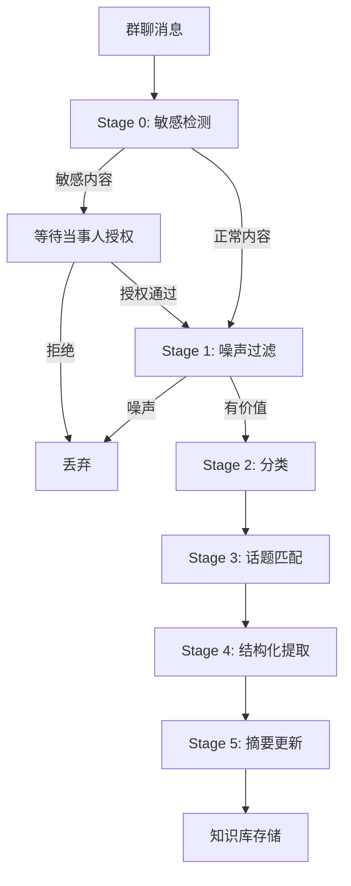

**流程说明：**

1. **Stage 0 - 敏感检测**：LLM识别是否涉及隐私、人事纠纷等敏感内容
2. **Stage 1 - 噪声过滤**：过滤"ok"、"收到"等无知识价值的消息
3. **Stage 2 - 分类**：将消息归类为9种信息类型之一
4. **Stage 3 - 话题匹配**：判断属于现有话题还是创建新话题
5. **Stage 4 - 结构化提取**：提取关键字段（决策内容、故障信息等）
6. **Stage 5 - 摘要更新**：增量更新话题摘要，保留历史版本

---

## 二、设计理念

### 2.1 核心价值主张

```
对话 → 资产
临时信息 → 持久知识
重复询问 → 自动沉淀
碎片讨论 → 结构共识
```

### 2.2 设计原则

| 原则 | 说明 |
|------|------|
| **信息平权** | 无论何时加入团队，均可获取历史决策与讨论上下文 |
| **零摩擦使用** | 在群聊中直接@机器人查询，无需切换应用 |
| **可信修正** | 当事人可修正LLM总结，修正可选同步至原群 |
| **主动服务** | AI管家主动推送、提醒、发现价值 |
| **隐私优先** | 敏感内容需全部当事人明确授权（7天超时升级管理员） |

### 2.3 信息类别体系

系统默认支持9类信息自动识别：

| 类别 | 典型内容 | 时间窗口 |
|------|----------|----------|
| 🏗️ 技术决策 | 架构选型、方案确认 | 永久 |
| ❓ 问题解答 | 技术问答、排查方法 | 90天 |
| 🐛 故障案例 | Bug报告、复盘记录 | 90天 |
| 📌 参考信息 | IP、URL、端口、账号名 | 永久 |
| ✅ 任务待办 | @人名 + 任务指派 | 30天 |
| 📋 讨论纪要 | 会议总结、共识记录 | 90天 |
| 📚 知识分享 | 技术文章、经验分享 | 180天 |
| ⚙️ 环境配置 | 部署步骤、配置说明 | 永久 |
| 🚀 项目动态 | 发布公告、里程碑 | 180天 |

---

## 三、核心功能

### 3.1 消息自动处理

系统通过Webhook接收自研聊天工具的消息，自动进行：

- **噪声识别**：过滤无意义的短消息
- **价值提取**：识别技术讨论、决策、问题解答
- **智能分类**：自动归类到9大信息类别
- **话题关联**：关联相关讨论，避免信息孤岛

### 3.2 搜索与问答

**全文搜索**：基于数据库全文检索（SQLite FTS5 或 PostgreSQL），支持关键词、类别、时间筛选

**智能问答**：
- LLM理解用户问题
- 检索相关知识库内容
- 生成综合答案并标注来源
- 支持追问和澄清

### 3.3 话题线索管理

每条知识以"话题线索"形式组织：

- **活摘要**：随新消息持续更新，保留历史版本
- **结构化数据**：按类别提取关键字段
- **当事人机制**：参与者可修正摘要
- **溯源链接**：可跳转原始群聊消息

### 3.4 敏感内容保护

涉及隐私、人事、纠纷的内容：

- 标记为敏感待授权状态
- 通知所有当事人处理
- 需全部当事人明确授权后才入库
- 7天未处理自动升级管理员
- 任一当事人拒绝则永不处理

### 3.5 AI管家服务

AI管家是平台的"灵魂"，提供主动服务：

- **每周知识快报**：统计新增知识、热门讨论、即将到期待办
- **待办到期提醒**：提前1天提醒任务负责人
- **敏感授权跟进**：实时通知授权状态变化
- **知识库健康报告**：评估知识覆盖率、问答质量
- **自主学习优化**：分析使用模式，持续改进服务

---

## 四、使用场景详解

### 4.1 客户端入口

RippleFlow提供三个客户端入口：

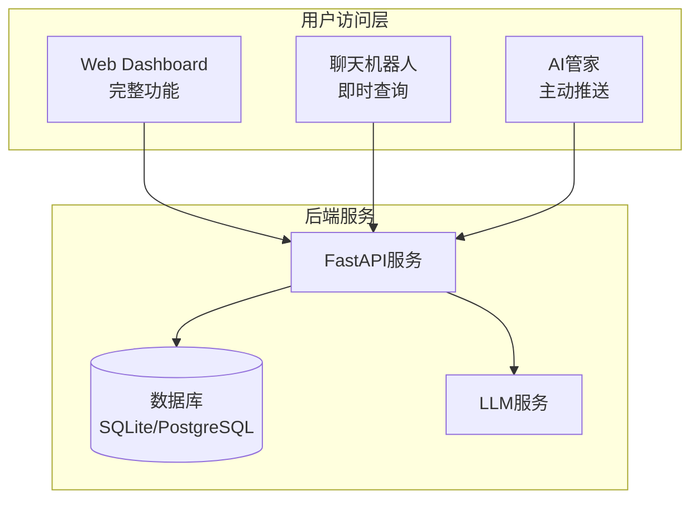

#### 4.1.1 Web Dashboard（完整功能）

**适用场景**：深度使用、管理操作、浏览知识库

**功能模块**：
- 知识库浏览（按类别、时间、标签筛选）
- 搜索问答（自然语言提问）
- 敏感授权处理
- 当事人修改摘要
- 个人贡献统计
- 管理后台（白名单、类别管理）

#### 4.1.2 聊天机器人（即时查询）

**适用场景**：轻量查询、快速获取答案

**使用方法**：在群聊中@机器人 + 自然语言查询

**支持的查询类型**：
- 知识库搜索/问答
- 个人待办查询
- 参考数据查询（IP、URL、配置）
- 会议纪要生成

#### 4.1.3 AI管家（主动服务）

**适用场景**：被动接收重要信息、定期总结

**服务形式**：
- 每周一早上推送知识快报
- 待办到期前提醒
- 敏感授权状态变化通知

---

### 4.2 场景一：新成员快速融入（信息平权）

**场景描述**：新成员加入团队，需要快速了解历史决策和项目背景

**用户角色**：新成员（普通成员权限）

**使用流程**：

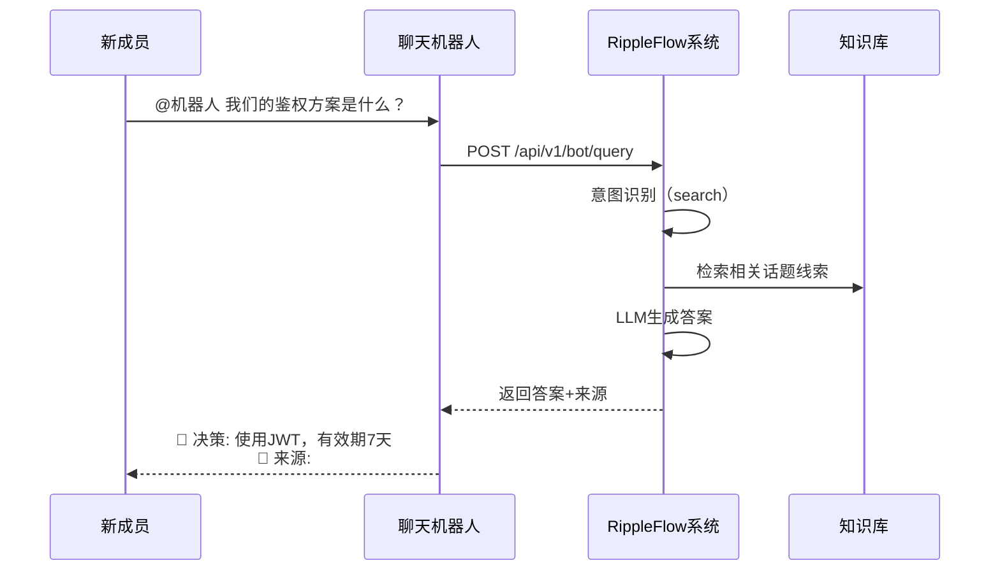

**用户价值**：
- 无需翻阅历史消息记录
- 直接获取决策结论和背景
- 可追溯原始讨论上下文
- 与资深成员拥有相同信息量

**E2E测试要点**：
- 自然语言查询意图识别
- 答案准确性和完整性
- 来源链接可点击跳转

---

### 4.3 场景二：技术问题快速解答（知识复用）

**场景描述**：开发中遇到技术问题，查询是否已有解决方案

**用户角色**：开发团队成员（普通成员权限）

**使用方式A - 群聊机器人**：

```
用户：@机器人 Redis连接超时怎么处理？

🤖 机器人回复：
找到 2 条相关记录：

📌 [FAQ] Redis 连接超时解决方案 ★★★★
   解决方法：检查 max_connections 配置...
   👤 李四 | 📅 2024-11-20 | 被引用 5 次

📌 [故障案例] 2024-12-05 生产环境 Redis 断连排查
   排查过程：首先检查网络连通性...
   👤 张三 | 📅 2024-12-05

💬 回复此消息可追问
💡 您也可以说："详细说说第一条" 
```

**使用方式B - Web Dashboard搜索**：

1. 打开 Dashboard → 搜索页
2. 输入："Redis 连接超时"
3. 查看搜索结果列表
4. 点击感兴趣的话题线索
5. 查看完整摘要和历史版本

**用户价值**：
- 避免重复讨论相同问题
- 快速获取经过验证的解决方案
- 了解问题的历史上下文
- 确认方案是否仍有效

**E2E测试要点**：
- 关键词搜索结果相关性
- 结果按时间/引用次数排序
- 详情页展示完整信息

---

### 4.4 场景三：参考信息快速查找（团队知识手册）

**场景描述**：查找测试环境地址、服务端口、配置参数等

**用户角色**：开发/测试人员（普通成员权限）

**使用流程**：

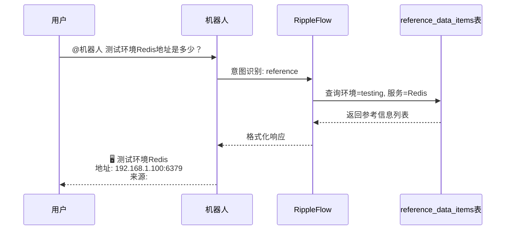

**参考信息卡片示例**：

```
🖥️ 测试环境: 192.168.1.100:8080 
   来源: #运维群, 2025-01-15
   
🔧 Jenkins: http://ci.internal.xxx 
   来源: #后端群, 2025-02-01
   
📦 NPM Mirror: http://npm.internal.xxx 
   来源: #前端群, 2024-12-03
   ⚠️ 已超过 90 天未更新，请确认是否仍有效
```

**用户价值**：
- 告别"测试地址是多少？"的重复询问
- 自动提取和更新参考信息
- 过期提醒防止使用失效配置

**E2E测试要点**：
- 参考信息自动提取准确性
- 按服务名/环境筛选功能
- 废弃标记和提醒机制

---

### 4.5 场景四：会议讨论自动纪要（共识沉淀）

**场景描述**：重要讨论后生成结构化纪要，确保共识被记录

**用户角色**：会议参与者（普通成员权限）

**使用流程**：

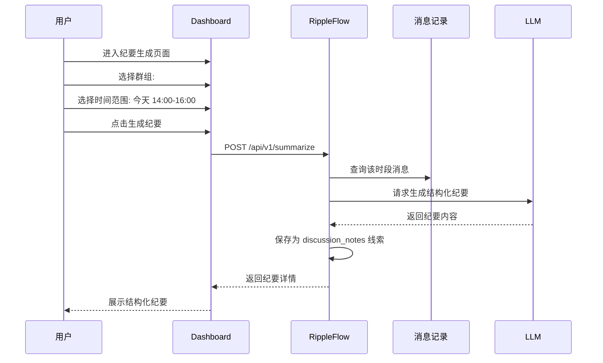

**纪要输出格式**：

```
📋 讨论主题: 产品v2.0发布计划
👥 参与者: 张三、李四、王五
🔍 背景: 需要确定v2.0的核心功能和发布时间

✅ 达成共识:
   • 核心功能: 智能推荐 + 数据看板
   • 发布时间: 2025-04-15
   • 测试周期: 3周

❓ 待解决:
   • 推荐算法的准确率目标是多少？（@张三 跟进）
   • 是否需要灰度发布？（待下次讨论）

📌 行动项:
   • 李四: 完成技术方案文档（截止: 2025-03-10）
   • 王五: 协调UI设计资源（截止: 2025-03-05）
```

**用户价值**：
- 自动整理讨论要点
- 明确记录决策和待办
- 可追溯讨论参与者
- 行动项自动创建待办

**E2E测试要点**：
- 消息数不足时的错误提示
- 纪要结构完整性（主题/参与者/共识/待办）
- 行动项自动提取准确性

---

### 4.6 场景五：敏感内容授权处理（隐私保护）

**场景描述**：群聊讨论涉及绩效、人事调整等敏感话题

**用户角色**：当事人（敏感内容参与者）

**系统处理流程**：

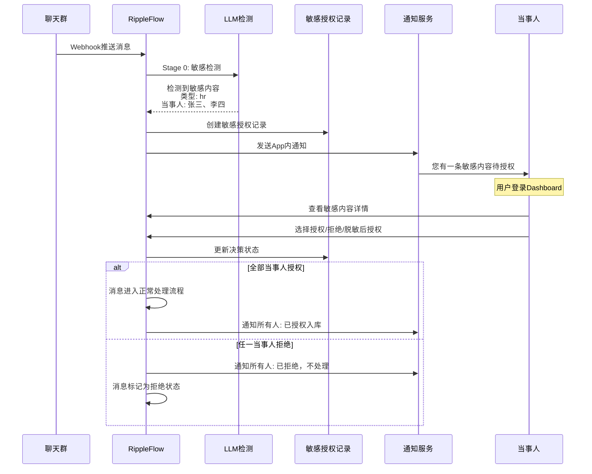

**用户操作界面**：

1. 收到通知："您有1条敏感内容待授权"
2. 点击查看详情：
   - 消息原文
   - 检测到的敏感类型（人事/绩效/纠纷）
   - 其他当事人决策状态
3. 选择操作：
   - ✅ **授权**：同意该内容入库
   - ❌ **拒绝**：不同意入库（永不处理）
   - 📝 **脱敏后授权**：提供脱敏版本（如"某员工"代替真实姓名）
4. 催促功能：24小时内可催促其他当事人处理

**升级机制**：

```
7天未处理 → 通知管理员介入
管理员可：
  • 移除离职当事人
  • 强制授权/拒绝
  • 查看所有待处理敏感内容
```

**用户价值**：
- 保护个人隐私和敏感信息
- 当事人自主决定是否入库
- 透明的授权流程和状态
- 防止信息泄露风险

**E2E测试要点**：
- 敏感内容检测准确性
- 通知及时性和完整性
- 授权/拒绝流程正确性
- 多当事人状态同步
- 升级机制触发条件

---

### 4.7 场景六：当事人修正摘要（知识准确性）

**场景描述**：LLM生成的摘要不完全准确，当事人进行修正

**用户角色**：话题线索当事人

**使用流程**：

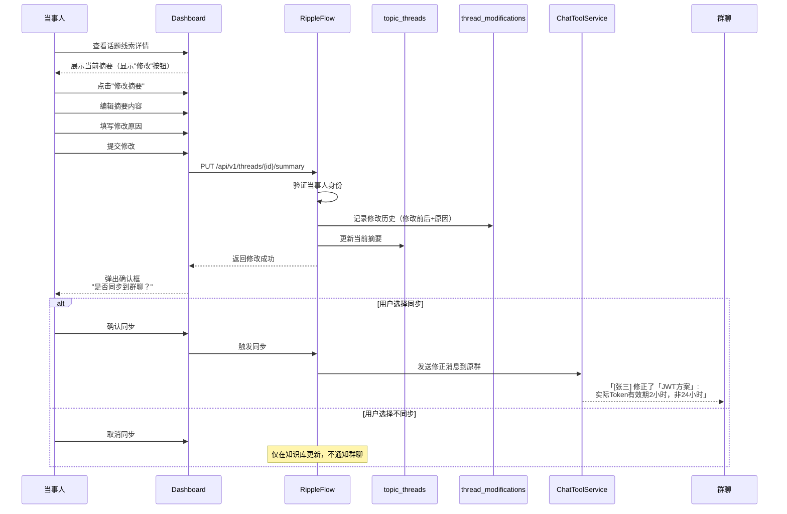

**修改记录展示**：

```
当前摘要: 
团队决定使用JWT进行鉴权，Token有效期为2小时...

[修改历史]
├── 版本 3 (2025-02-28 15:30)
│   修改人: 张三
│   修改内容: 将"24小时"修正为"2小时"
│   原因: LLM总结有误，实际Token有效期2小时
├── 版本 2 (2025-02-28 10:15)
│   修改人: 李四
│   修改内容: 补充了JWT存储位置的说明
│   原因: 增加实现细节
└── 版本 1 (2025-02-28 09:00)
    创建人: AI生成
    初始摘要
```

**用户价值**：
- 确保知识库内容准确可靠
- 保留修改历史和原因
- 可选同步到群聊通知所有人
- 形成知识持续完善的闭环

**E2E测试要点**：
- 当事人身份验证
- 修改必填字段校验
- 历史版本正确记录
- 同步到群聊功能

---

### 4.8 场景七：个人待办管理（任务跟踪）

**场景描述**：群聊中讨论的任务自动识别并跟踪

**用户角色**：任务责任人/普通成员

**自动识别场景**：

```
群聊消息示例：
"@张三 你来负责Redis集群配置，下周三前完成"
"@李四 @王五 你们俩配合做前端优化，这周五给个方案"
```

**系统自动处理**：

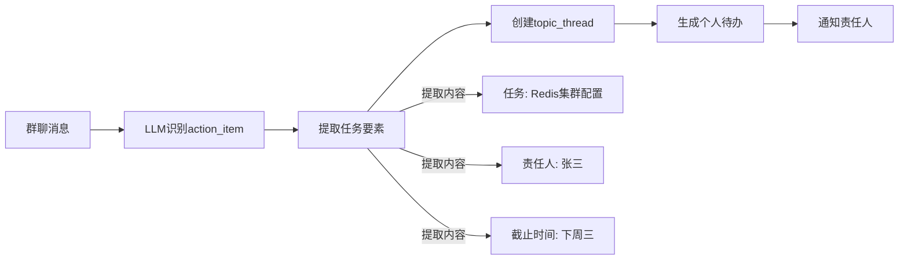

**用户查看待办**：

**方式A - 群聊机器人**：
```
用户：@机器人 我有什么待办

🤖 机器人回复：
您有 3 个待办任务：

🔴 高优先级
└── Redis集群配置（截止: 2025-03-05）
    来源: #后端群 2025-02-28
    
🟡 中优先级
├── 前端优化方案（截止: 2025-03-03）
│   来源: #产品群 2025-02-27
└── 接口文档更新（截止: 2025-03-10）
    来源: #后端群 2025-02-26
```

**方式B - Web Dashboard**：
- 进入"待办任务"页面
- 按状态筛选：待处理/进行中/已完成
- 按优先级筛选：紧急/高/中/低
- 点击任务查看详情和来源
- 标记任务完成

**待办到期提醒**：

```mermaid
sequenceDiagram
    participant B as nullclaw cron
    participant A as AIButlerService
    participant T as 待办列表
    participant C as ChatToolService
    participant U as 用户

    B->>A: 每日 9:00 触发
    A->>T: 查询明天到期的待办
    A->>C: 发送提醒消息
    C->>U: @张三 您有2个待办明天到期:
           • Redis集群配置
           • 接口文档更新
           点击查看详情 [链接]
```

**用户价值**：
- 自动从群聊提取任务
- 集中管理所有待办
- 到期提醒防止遗漏
- 追溯任务来源上下文

**E2E测试要点**：
- 任务自动识别准确性
- 责任人/截止时间提取
- 待办列表筛选功能
- 状态更新同步

---

### 4.9 场景八：管理员系统配置（权限管理）

**场景描述**：管理员进行用户管理和系统配置

**用户角色**：管理员

**功能清单**：

| 功能 | 说明 |
|------|------|
| **白名单管理** | 添加/移除系统用户，控制访问权限 |
| **类别管理** | 新增自定义信息类别，扩展分类体系 |
| **敏感授权介入** | 处理超时未决的敏感内容授权 |
| **系统统计** | 查看消息量、知识库规模、活跃用户数 |
| **AI管家配置** | 配置管家任务、审批管家提案 |

**白名单管理流程**：

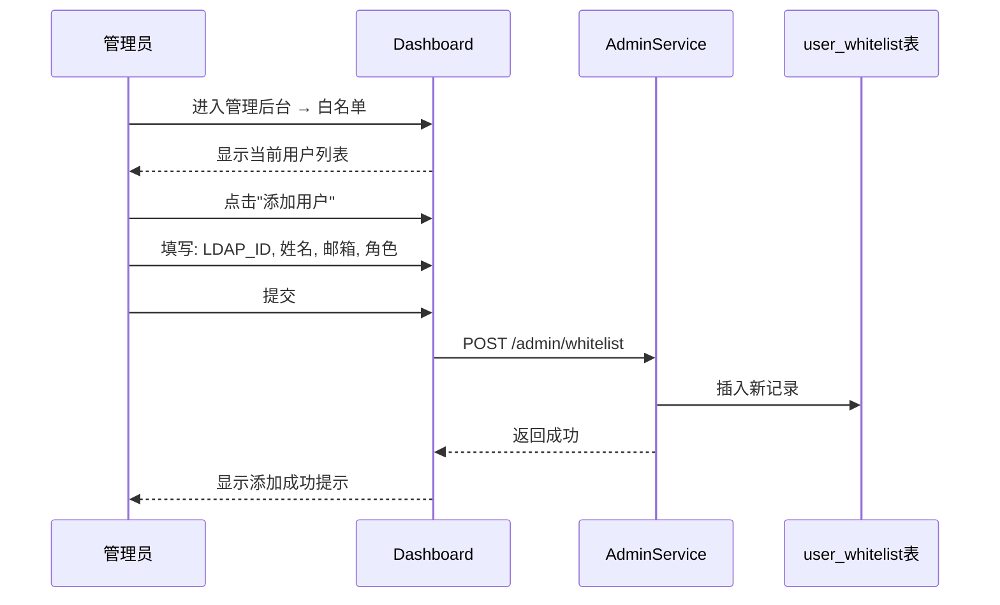

**新增自定义类别示例**：

```
类别代码: security_alert
显示名称: 安全告警
触发提示词: 安全漏洞,CVE,攻击,入侵,风险告警
时间窗口: 180天

效果: 
后续群聊消息若涉及安全相关内容
将自动归类为"安全告警"类别
```

**用户价值**：
- 精细化控制用户访问权限
- 按需扩展信息分类体系
- 处理特殊情况（如离职员工）
- 了解系统使用状况

**E2E测试要点**：
- 管理员权限验证
- 普通用户无法访问管理功能
- 添加/移除用户功能
- 类别创建和生效

---

### 4.10 场景九：AI管家每周快报（知识运营）

**场景描述**：自动汇总团队知识沉淀情况，推送到主群

**系统自动化流程**：

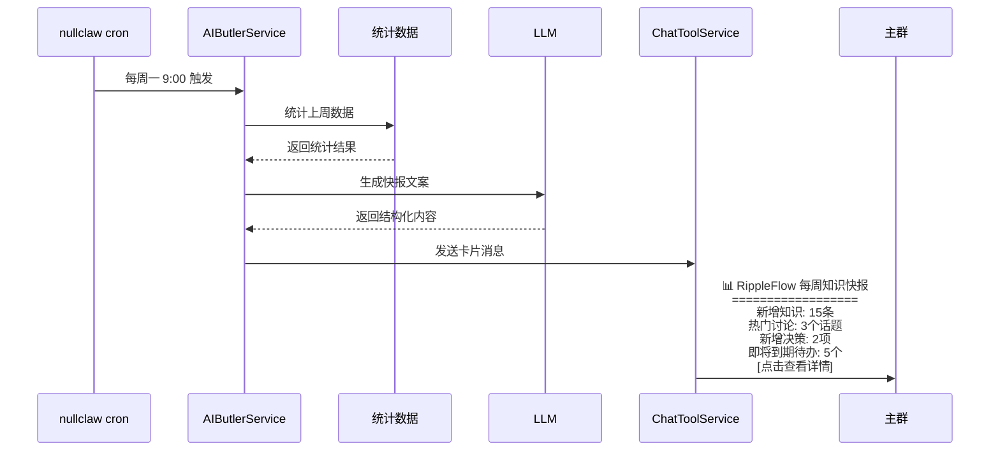

**快报内容示例**：

```
📊 RippleFlow 每周知识快报 (2025-02-24 ~ 2025-03-02)

📈 本周概览
├── 新增知识条目: 15 条
│   ├── 技术决策: 2 条
│   ├── 问题解答: 5 条
│   ├── 故障案例: 1 条
│   └── 参考信息: 7 条
├── 活跃讨论: 3 个话题
├── 问答使用: 23 次
└── 摘要修正: 4 次

🔥 热门讨论 Top 3
1. [技术决策] 数据库选型讨论 (15条消息)
2. [故障案例] 生产环境内存泄漏排查 (12条消息)
3. [知识分享] K8s最佳实践分享 (8条消息)

⚠️ 即将到期待办
• @张三 Redis集群配置 (截止: 明天)
• @李四 接口文档更新 (截止: 后天)
• @王五 前端优化方案 (截止: 3天后)

💡 推荐阅读
• [FAQ] SpringBoot 性能调优指南
• [决策] 缓存策略选型方案
```

**用户价值**：
- 了解团队知识沉淀情况
- 发现重要讨论和决策
- 及时跟进即将到期任务
- 促进知识分享和学习

**E2E测试要点**：
- 定时任务触发正确性
- 统计数据准确性
- 消息格式和链接正确
- 管理员可手动触发

---

### 4.11 场景十：知识库问答反馈（质量改进）

**场景描述**：用户对问答结果进行评价，帮助改进系统

**用户角色**：普通成员

**使用流程**：

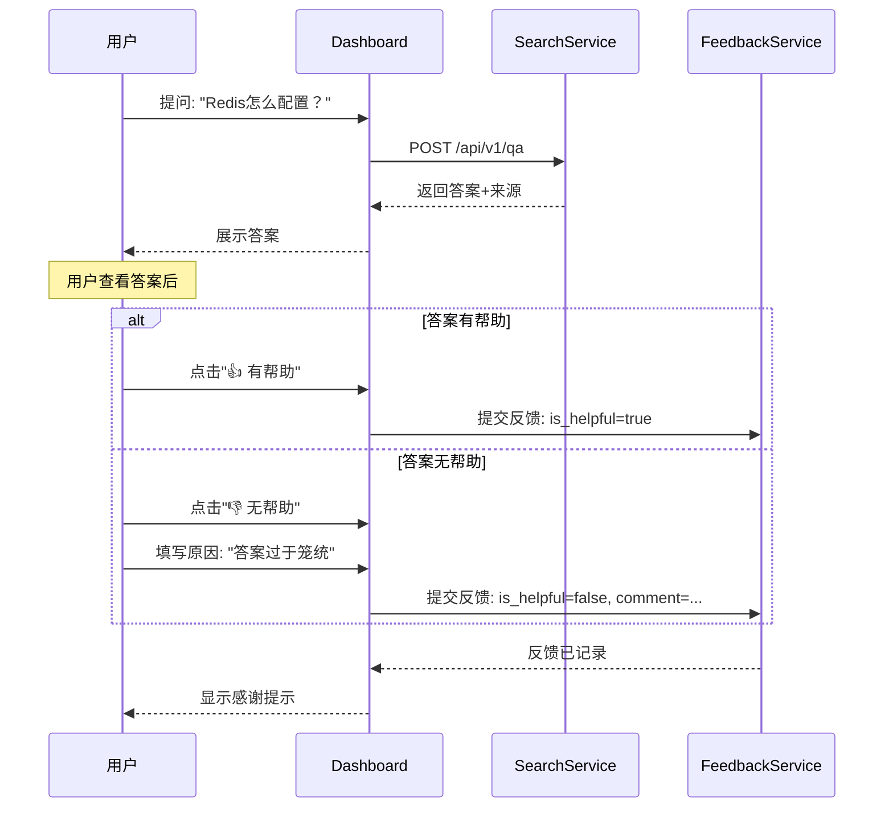

**反馈数据分析**：

管理员可在后台查看：
- 问答满意度趋势
- 低分答案分析
- 常见问题类型统计
- 系统改进建议

**AI管家学习**：

```
管家经验知识库自动更新:
- 高峰使用时段: "周一上午问答量大"
- 常见问题模式: "Redis配置相关占比30%"
- 低分答案模式: "缺少具体配置步骤的答案评分较低"
```

**用户价值**：
- 帮助改进问答质量
- 让系统更懂团队需求
- 提升后续问答体验
- 参与知识库建设

**E2E测试要点**：
- 反馈提交功能
- 评分和备注记录
- 统计数据展示

---

### 4.12 场景十一：个人贡献统计（价值感知）

**场景描述**：查看个人在知识库中的贡献和参与情况

**用户角色**：普通成员

**查看内容**：

```
👤 张三的知识贡献

📊 概览
├── 参与话题: 23 个
├── 发起讨论: 8 个
├── 修正摘要: 5 次
├── 解答问题: 12 次（被采纳）
└── 贡献排名: 团队第 3 名

📈 本周动态
├── 新增参与: 3 个话题
├── 收到赞同: 7 次
└── 帮助同事: 5 人次

🏆 擅长领域
1. Redis 相关 (6个话题)
2. SpringBoot (4个话题)
3. 性能优化 (3个话题)

📜 最近参与
• [决策] 数据库选型方案 (2025-02-28)
• [FAQ] Redis集群配置 (2025-02-27)
• [故障] 内存泄漏排查 (2025-02-26)
```

**用户价值**：
- 了解个人知识贡献
- 发现个人专业领域
- 激励知识分享
- 促进团队协作

---

## 五、模块交互流程

### 5.1 系统整体架构

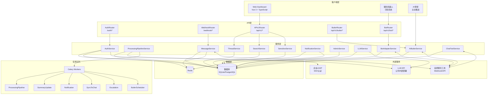

### 5.2 消息处理流水线详细流程

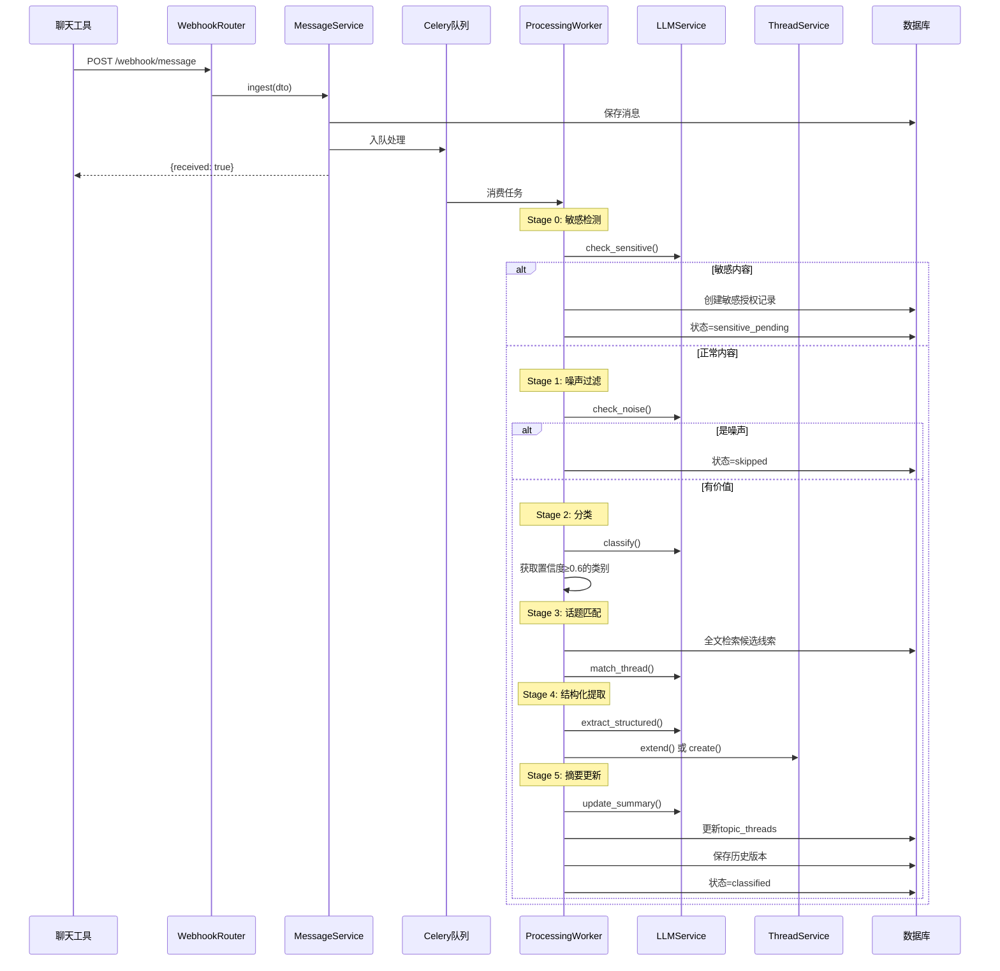

### 5.3 搜索问答流程

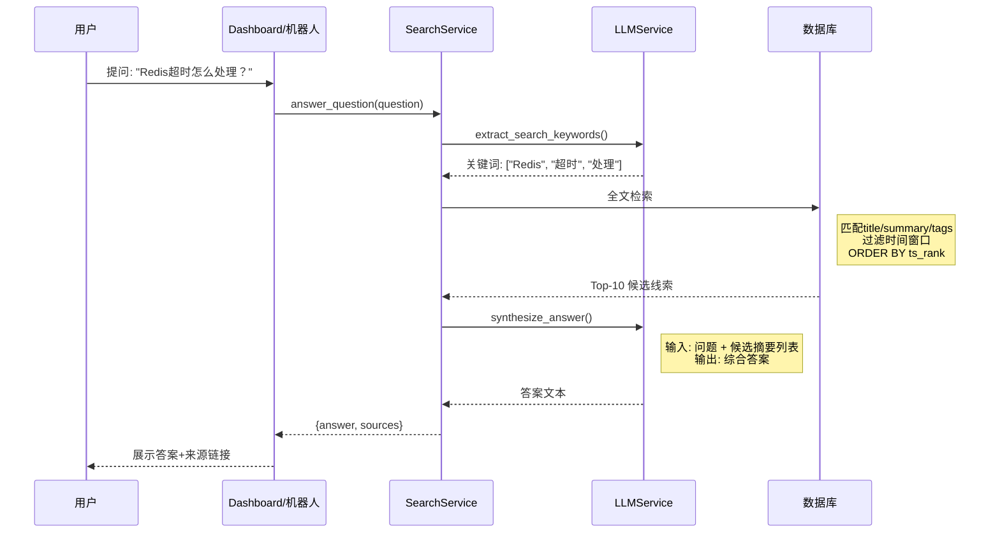

### 5.4 敏感授权完整流程

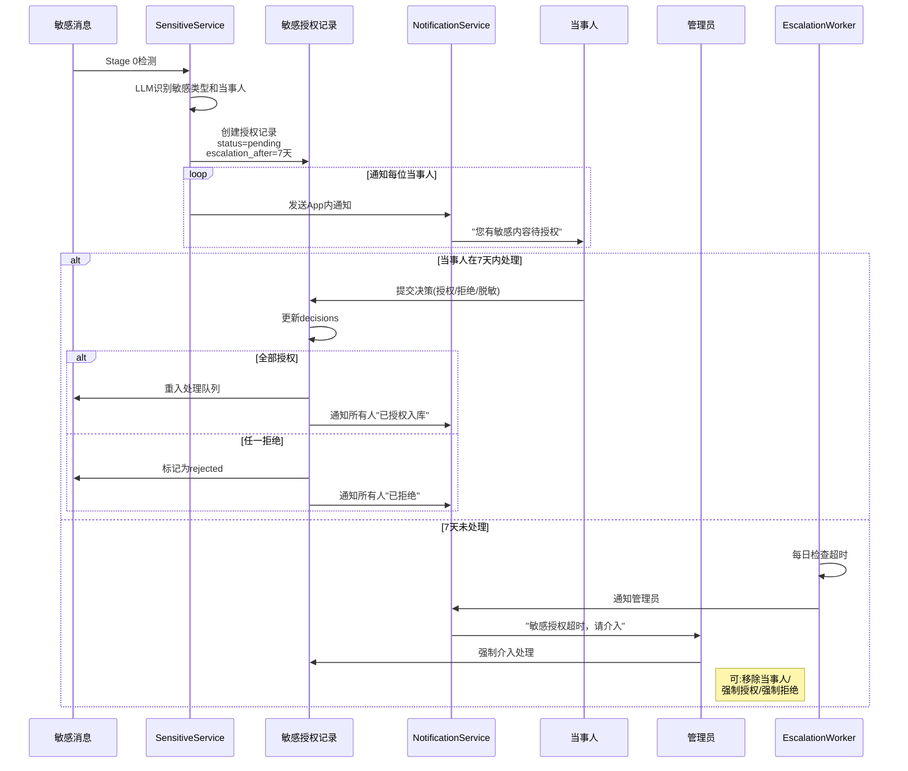

---

## 六、客户端使用指南

### 6.1 Web Dashboard 使用说明

#### 6.1.1 登录

1. 访问 RippleFlow Dashboard URL
2. 点击"企业SSO登录"
3. 输入LDAP用户名密码
4. 登录成功后进入Dashboard

**注意**：若提示"请联系管理员申请访问权限"，说明您的账号不在白名单中，请联系团队管理员添加。

#### 6.1.2 首页概览

登录后看到：
- 未读通知数
- 本周知识新增统计
- 热门话题推荐
- 快速搜索入口
- 我的待办提醒

#### 6.1.3 搜索问答

**简单搜索**：
1. 顶部搜索框输入关键词
2. 按Enter或点击搜索
3. 浏览搜索结果列表
4. 点击结果查看详情

**高级搜索**：
1. 进入"搜索"页面
2. 输入搜索词
3. 选择类别筛选（技术决策/FAQ/故障案例等）
4. 选择时间范围
5. 勾选"忽略时间窗口"可查找历史内容

**智能问答**：
1. 切换到"问答"标签
2. 用自然语言提问（如"Redis连接超时怎么处理"）
3. 系统生成综合答案
4. 查看答案来源
5. 可追问或提交反馈

#### 6.1.4 浏览话题线索

**知识库浏览**：
1. 进入"知识库"页面
2. 按类别筛选（左侧导航）
3. 按时间排序
4. 点击话题查看详情

**话题详情页**：
- 标题和类别标签
- 当前摘要
- 结构化数据（按类别展示）
- 关联消息列表
- 修改历史
- 当事人列表

#### 6.1.5 当事人操作

**修正摘要**（仅当事人可见"修改"按钮）：
1. 进入话题详情页
2. 点击"修改摘要"按钮
3. 编辑摘要内容
4. 填写修改原因（必填）
5. 提交修改
6. 选择是否同步到原群聊

**处理敏感授权**：
1. 收到通知后点击跳转
2. 或进入"通知中心" → "敏感授权"
3. 查看消息原文
4. 选择操作：
   - ✅ 授权：同意入库
   - ❌ 拒绝：不同意入库
   - 📝 脱敏后授权：提供脱敏版本
5. 提交决策

#### 6.1.6 查看待办

1. 进入"待办任务"页面
2. 查看指派给您的任务
3. 按状态筛选：待处理/进行中/已完成
4. 点击任务查看详情
5. 点击"标记完成"

#### 6.1.7 生成会议纪要

1. 进入"纪要生成"页面
2. 选择群组
3. 选择时间范围（或选择"今天"）
4. 点击"生成纪要"
5. 等待LLM处理
6. 查看结构化纪要
7. 可编辑调整后保存

#### 6.1.8 查看个人贡献

1. 点击右上角用户菜单
2. 选择"我的贡献"
3. 查看统计数据
4. 浏览参与过的话题

#### 6.1.9 管理后台（管理员）

**白名单管理**：
1. 进入"管理后台" → "用户白名单"
2. 查看现有用户列表
3. 点击"添加用户"
4. 填写LDAP ID、姓名、邮箱、角色
5. 保存

**类别管理**：
1. 进入"管理后台" → "信息类别"
2. 查看内置类别
3. 点击"新增类别"
4. 填写类别代码、显示名称、触发提示词
5. 保存后对新消息生效

**系统统计**：
1. 进入"管理后台" → "系统统计"
2. 查看消息量、知识库规模、活跃用户
3. 导出统计报告

---

### 6.2 聊天机器人使用说明

#### 6.2.1 基本使用

在任意群聊中@机器人 + 自然语言：

```
@RippleBot Redis连接池怎么配置
@RippleBot 我有什么待办
@RippleBot prod环境的Redis地址
@RippleBot 生成今天产品群的会议纪要
@RippleBot 上周讨论了什么重要的事
```

#### 6.2.2 支持的查询类型

| 查询意图 | 示例 | 说明 |
|----------|------|------|
| **搜索问答** | "Redis超时怎么处理" | 基于知识库回答 |
| **待办查询** | "我有什么待办" | 查看指派给您的任务 |
| **参考查询** | "测试环境地址" | 查找IP/URL/配置 |
| **纪要生成** | "生成今天产品群纪要" | 生成结构化纪要 |
| **历史回顾** | "上周讨论了什么" | 带时间过滤的搜索 |

#### 6.2.3 追问和交互

机器人回复后，您可以：
- 回复消息进行追问
- 说"详细说说第一条"获取详情
- 说"还有其他相关内容吗"查看更多

#### 6.2.4 响应示例

**搜索问答响应**：
```
🤖 找到 2 条相关记录：

📌 [FAQ] Redis连接超时解决方案 ★★★★
   解决方法：检查max_connections配置...
   👤 李四 | 📅 2024-11-20 | 被引用5次
   [查看详情] [跳转原消息]

📌 [故障案例] 生产环境Redis断连排查
   排查过程：首先检查网络连通性...
   👤 张三 | 📅 2024-12-05
   [查看详情]

💡 您也可以说："详细说说第一条"
```

**待办查询响应**：
```
📋 您有 3 个待办任务：

🔴 高优先级
└── Redis集群配置（截止: 2025-03-05）
    来源: #后端群

🟡 中优先级
├── 前端优化方案（截止: 2025-03-03）
└── 接口文档更新（截止: 2025-03-10）

[查看全部待办]
```

**参考信息响应**：
```
📌 测试环境Redis
   地址: 192.168.1.100:6379
   密码: 见Vault
   来源: #运维群, 2025-01-15
   ⚠️ 超过90天未更新
```

---

### 6.3 AI管家服务说明

AI管家是系统的"智能运营大脑"，您会收到以下主动推送：

#### 6.3.1 每周知识快报

**接收时间**：每周一上午9:00
**接收方式**：推送到主群（卡片消息）
**内容包括**：
- 上周新增知识统计
- 热门讨论Top 3
- 新增技术决策
- 即将到期待办提醒
- 推荐阅读

#### 6.3.2 待办到期提醒

**接收时间**：每天上午9:00
**触发条件**：有待办将在明天到期
**接收方式**：群聊@提醒
**内容包括**：
- 任务名称
- 截止时间
- 任务来源
- 查看详情链接

#### 6.3.3 敏感授权状态更新

**接收时间**：实时
**触发条件**：当事人提交决策
**接收方式**：App内通知 + 群聊通知
**内容包括**：
- 当前授权状态
- 已表态/未表态人数
- 催促按钮（24小时后可点）

---

## 七、常见问题

### 7.1 登录相关

**Q: 提示"请联系管理员申请访问权限"怎么办？**

A: 您的LDAP账号不在系统白名单中。请联系团队管理员，提供您的LDAP用户名、姓名、邮箱，申请添加。

**Q: 登录后显示"权限不足"？**

A: 某些功能需要特定权限：
- 当事人修改：仅话题参与者可用
- 管理后台：仅管理员可用
- 敏感授权详情：仅当事人可查看

### 7.2 搜索问答

**Q: 搜索不到历史内容？**

A: 可能原因：
1. **时间窗口限制**：某些类别（如FAQ）默认只显示90天内内容，勾选"忽略时间窗口"可查找全部
2. **敏感内容**：涉及敏感话题需授权后才可检索
3. **噪声过滤**：无价值消息被过滤，未入知识库

**Q: 问答答案不准确？**

A: 您可以：
1. 点击"👎 无帮助"提交反馈
2. 如果您是当事人，可修正摘要
3. 在群聊中讨论后生成新纪要

### 7.3 消息处理

**Q: 为什么有些群聊消息没进入知识库？**

A: 可能原因：
1. **噪声过滤**："ok"、"收到"等短消息被过滤
2. **敏感待授权**：内容涉及隐私，等待当事人授权
3. **分类置信度低**：LLM判断不属于9大类别
4. **Webhook故障**：聊天工具推送失败（请联系管理员）

**Q: 敏感内容多久需要处理？**

A: 默认7天内需处理，否则将升级通知管理员。建议及时处理，避免信息积压。

### 7.4 功能使用

**Q: 如何修改已提交的敏感授权决策？**

A: 已拒绝的决策无法更改。已授权的决策可以联系管理员处理。

**Q: 当事人可以修改其他当事人的待办吗？**

A: 不可以。每个成员只能查看和完成指派给自己的待办。

**Q: 机器人查询不到某些内容？**

A: 可能原因：
1. 权限限制：某些敏感内容需授权后才可查询
2. 时间窗口：超出默认时间范围
3. 分类筛选：查询条件不匹配

### 7.5 系统维护

**Q: 如何新增信息类别？**

A: 只有管理员可在管理后台新增类别。新增后对新消息生效，历史消息不会重新处理。

**Q: 离职员工的敏感授权怎么办？**

A: 管理员可在管理后台介入处理，移除离职当事人或强制决策。

**Q: 系统响应慢怎么办？**

A: 可能原因：
1. LLM服务繁忙（公司内部部署，请联系IT）
2. 大量消息正在处理中
3. 网络连接问题

---

## 附录

### A. 角色权限对照表

| 能力 | 普通成员 | 当事人 | 管理员 |
|------|----------|--------|--------|
| 查看知识库 | ✅ | ✅ | ✅ |
| 搜索/问答 | ✅ | ✅ | ✅ |
| 提交问答反馈 | ✅ | ✅ | ✅ |
| 查看个人贡献统计 | ✅ | ✅ | ✅ |
| 修改所参与的话题线索 | ❌ | ✅ | ✅ |
| 敏感内容授权（仅本人） | ❌ | ✅ | ✅ |
| 触发纪要生成 | ✅ | ✅ | ✅ |
| 白名单管理 | ❌ | ❌ | ✅ |
| 类别管理 | ❌ | ❌ | ✅ |
| 强制归档/删除 | ❌ | ❌ | ✅ |
| 管理员介入敏感授权 | ❌ | ❌ | ✅ |
| 配置AI管家任务 | ❌ | ❌ | ✅ |

### B. 信息类别详细说明

| 类别 | 识别特征 | 提取字段 | 时间窗口 |
|------|----------|----------|----------|
| 技术决策 | 含"决定"、"方案"、"选型"、"改用" | decision, alternatives, rationale, decision_makers | 永久 |
| 问题解答 | 提问+有效回答+确认信号 | question, answer, confidence, sources | 90天 |
| 故障案例 | Bug/故障+定位过程+解法 | error_msg, service, root_cause, resolution, status | 90天 |
| 参考信息 | IP、URL、端口、账号名 | resource_type, value, environment, service | 永久 |
| 任务待办 | @人名+动作动词+截止语气 | task, assignee, due_date, priority, status | 30天 |
| 讨论纪要 | 多人长讨论/手动触发 | topic, participants, consensus, open_questions, action_items | 90天 |
| 知识分享 | 技术文章、工具推荐、心得 | title, content, author, tags, relevance | 180天 |
| 环境配置 | 配置/部署/setup/env变量 | environment, service, config_values, setup_steps | 永久 |
| 项目动态 | 上线/发布/里程碑/版本号 | event_type, version, description, impact | 180天 |

### C. 技术支持联系方式

如有问题，请联系：
- 系统管理员：[管理员邮箱]
- 技术支持：[技术支持邮箱]
- 企业IT：[企业IT邮箱]

---

**文档版本历史**

| 版本 | 日期 | 更新内容 |
|------|------|----------|
| v1.0 | 2026-03-02 | 初始版本，覆盖全部核心功能和使用场景 |

---

*本手册基于 RippleFlow 系统设计文档编写，如有功能更新，请以最新文档为准。*
