# RippleFlow 用户手册

## 文档信息

| 项目 | 内容 |
|------|------|
| 版本 | v0.5 |
| 日期 | 2026-03-02 |
| 适用对象 | 创业软件开发团队成员 |

---

## 目录

1. [系统概述](#一系统概述)
2. [设计理念](#二设计理念)
3. [核心功能](#三核心功能)
4. [使用场景详解](#四使用场景详解)
5. [模块交互流程](#五模块交互流程)
6. [客户端使用指南](#六客户端使用指南)
7. [常见问题](#七常见问题)

---

## 一、系统概述

### 1.1 什么是 RippleFlow

**RippleFlow** 是一款面向创业软件开发团队的自用效率工具，核心定位为：

> 让团队的群聊历史变成一个会思考、会回答、会自动整理的活知识库

### 1.2 主要功能

| 功能 | 说明 |
|------|------|
| **智能消息处理** | 自动识别有价值信息，过滤噪声 |
| **知识自动分类** | 将消息归类为决策、FAQ、故障案例、参考信息等9大类别 |
| **话题线索管理** | 关联相关讨论，生成活摘要，持续更新 |
| **搜索问答** | 自然语言提问，FAQ 优先命中，LLM 兜底生成综合答案 |
| **FAQ 知识库** | 高频问答自动沉淀为结构化 FAQ，nullclaw 持续演进，经管理员审核后对外展示 |
| **敏感内容保护** | 涉及隐私/人事的内容需当事人授权后才入库 |
| **当事人修正** | 参与者可修正AI摘要，确保准确性 |
| **参考信息管理** | 自动提取IP、URL等，形成团队知识手册 |
| **待办任务跟踪** | 识别群聊中的任务指派，自动创建待办 |
| **AI管家服务** | 主动推送知识快报、待办提醒、健康报告 |

### 1.3 工作原理

RippleFlow 平台通过 **5阶段流水线（Stage 0–4）** 处理每条群聊消息，处理完成后事件推送至 **nullclaw AI 管家** 进行摘要更新和知识挖掘：

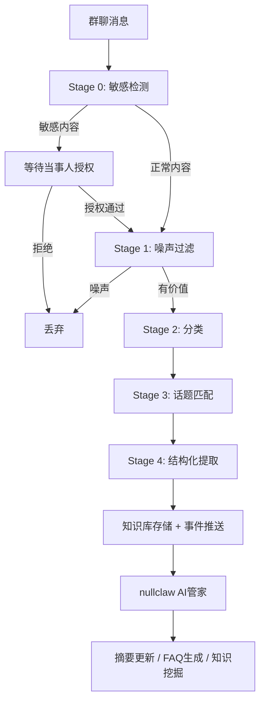

**流程说明：**

1. **Stage 0 - 敏感检测**：LLM识别是否涉及隐私、人事纠纷等敏感内容
2. **Stage 1 - 噪声过滤**：过滤"ok"、"收到"等无知识价值的消息
3. **Stage 2 - 分类**：将消息归类为9种信息类型之一
4. **Stage 3 - 话题匹配**：判断属于现有话题还是创建新话题
5. **Stage 4 - 结构化提取**：提取关键字段（决策内容、故障信息等）
6. **（nullclaw）摘要更新**：Stage 4 完成后事件推送至 AI 管家，由管家决策并执行增量摘要更新、FAQ 生成等知识运营操作

---

## 二、设计理念

### 2.1 核心价值主张

```
对话 → 资产
临时信息 → 持久知识
重复询问 → 自动沉淀
碎片讨论 → 结构共识
```

### 2.2 设计原则

| 原则 | 说明 |
|------|------|
| **信息平权** | 无论何时加入团队，均可获取历史决策与讨论上下文 |
| **零摩擦使用** | 在群聊中直接@机器人查询，无需切换应用 |
| **可信修正** | 当事人可修正LLM总结，修正可选同步至原群 |
| **主动服务** | AI管家主动推送、提醒、发现价值 |
| **隐私优先** | 敏感内容需全部当事人明确授权（7天超时升级管理员） |

### 2.3 信息类别体系

系统默认支持9类信息自动识别：

| 类别 | 典型内容 | 时间窗口 |
|------|----------|----------|
| 🏗️ 技术决策 | 架构选型、方案确认 | 永久 |
| ❓ 问题解答 | 技术问答、排查方法 | 90天 |
| 🐛 故障案例 | Bug报告、复盘记录 | 90天 |
| 📌 参考信息 | IP、URL、端口、账号名 | 永久 |
| ✅ 任务待办 | @人名 + 任务指派 | 30天 |
| 📋 讨论纪要 | 会议总结、共识记录 | 90天 |
| 📚 知识分享 | 技术文章、经验分享 | 180天 |
| ⚙️ 环境配置 | 部署步骤、配置说明 | 永久 |
| 🚀 项目动态 | 发布公告、里程碑 | 180天 |

---

## 三、核心功能

### 3.1 消息自动处理

系统通过Webhook接收自研聊天工具的消息，自动进行：

- **噪声识别**：过滤无意义的短消息
- **价值提取**：识别技术讨论、决策、问题解答
- **智能分类**：自动归类到9大信息类别
- **话题关联**：关联相关讨论，避免信息孤岛

### 3.2 搜索与问答

**全文搜索**：基于数据库全文检索（SQLite FTS5 或 PostgreSQL），支持关键词、类别、时间筛选

**智能问答**：
- LLM理解用户问题
- 检索相关知识库内容
- 生成综合答案并标注来源
- 支持追问和澄清

### 3.3 话题线索管理

每条知识以"话题线索"形式组织：

- **活摘要**：随新消息持续更新，保留历史版本
- **结构化数据**：按类别提取关键字段
- **当事人机制**：参与者可修正摘要
- **溯源链接**：可跳转原始群聊消息

### 3.4 敏感内容保护

涉及隐私、人事、纠纷的内容：

- 标记为敏感待授权状态
- 通知所有当事人处理
- 需全部当事人明确授权后才入库
- 7天未处理自动升级管理员
- 任一当事人拒绝则永不处理

### 3.5 AI管家服务（nullclaw）

nullclaw AI管家是平台的"灵魂"，独立运行于 RippleFlow 平台之外，负责所有涉及自然语言理解和策略决策的智能行为：

- **摘要更新**：Stage 4 完成后接收事件，决策并执行话题摘要的增量更新
- **FAQ 自动生成**：将高频 `qa_faq` 类线索提炼为结构化 FAQ 条目
- **每周知识快报**：统计新增知识、热门讨论、即将到期待办
- **待办到期提醒**：提前1天提醒任务负责人
- **敏感授权跟进**：实时通知授权状态变化
- **知识库健康报告**：评估知识覆盖率、问答质量
- **自主学习优化**：分析使用模式，通过自省周期持续改进服务

---

## 四、使用场景详解

### 4.1 客户端入口

RippleFlow提供三个客户端入口：

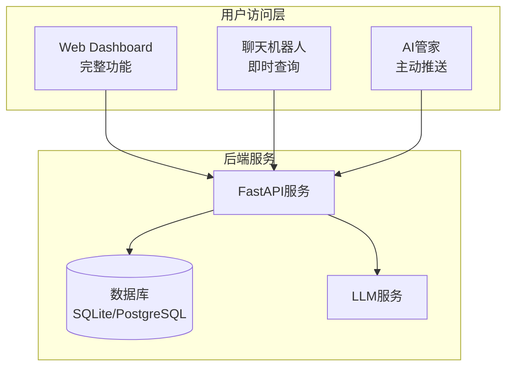

#### 4.1.1 Web Dashboard（完整功能）

**适用场景**：深度使用、管理操作、浏览知识库

**功能模块**：
- 知识库浏览（按类别、时间、标签筛选）
- **FAQ 知识库**（章节树浏览、全文搜索、来源溯源、答案反馈）
- 搜索问答（自然语言提问，FAQ 优先命中）
- 敏感授权处理
- 当事人修改摘要
- 个人贡献统计
- 管理后台（白名单、类别管理、**FAQ 审核队列**）

#### 4.1.2 聊天机器人（即时查询）

**适用场景**：轻量查询、快速获取答案

**使用方法**：在群聊中@机器人 + 自然语言查询

**支持的查询类型**：
- 知识库搜索/问答
- 个人待办查询
- 参考数据查询（IP、URL、配置）
- 会议纪要生成

#### 4.1.3 AI管家（主动服务）

**适用场景**：被动接收重要信息、定期总结

**服务形式**：
- 每周一早上推送知识快报
- 待办到期前提醒
- 敏感授权状态变化通知

---

### 4.2 场景一：新成员快速融入（信息平权）

**场景描述**：新成员加入团队，需要快速了解历史决策和项目背景

**用户角色**：新成员（普通成员权限）

**使用流程**：

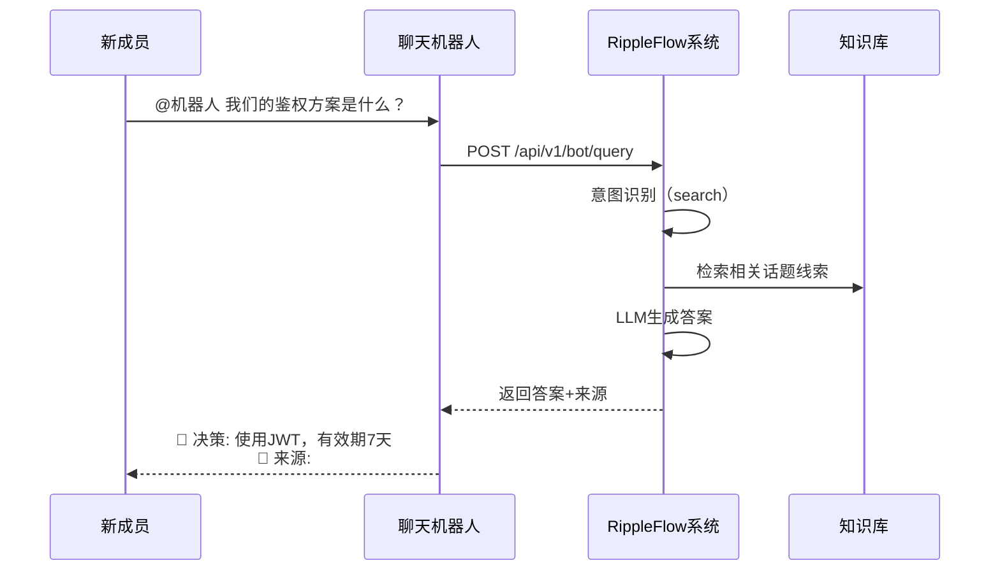

**用户价值**：
- 无需翻阅历史消息记录
- 直接获取决策结论和背景
- 可追溯原始讨论上下文
- 与资深成员拥有相同信息量

**E2E测试要点**：
- 自然语言查询意图识别
- 答案准确性和完整性
- 来源链接可点击跳转

---

### 4.3 场景二：技术问题快速解答（知识复用）

**场景描述**：开发中遇到技术问题，查询是否已有解决方案

**用户角色**：开发团队成员（普通成员权限）

**使用方式A - 群聊机器人**：

```
用户：@机器人 Redis连接超时怎么处理？

🤖 机器人回复：
找到 2 条相关记录：

📌 [FAQ] Redis 连接超时解决方案 ★★★★
   解决方法：检查 max_connections 配置...
   👤 李四 | 📅 2024-11-20 | 被引用 5 次

📌 [故障案例] 2024-12-05 生产环境 Redis 断连排查
   排查过程：首先检查网络连通性...
   👤 张三 | 📅 2024-12-05

💬 回复此消息可追问
💡 您也可以说："详细说说第一条" 
```

**使用方式B - Web Dashboard搜索**：

1. 打开 Dashboard → 搜索页
2. 输入："Redis 连接超时"
3. 查看搜索结果列表
4. 点击感兴趣的话题线索
5. 查看完整摘要和历史版本

**用户价值**：
- 避免重复讨论相同问题
- 快速获取经过验证的解决方案
- 了解问题的历史上下文
- 确认方案是否仍有效

**E2E测试要点**：
- 关键词搜索结果相关性
- 结果按时间/引用次数排序
- 详情页展示完整信息

---

### 4.3b 场景二补充：FAQ 知识库（群聊知识沉淀）

**场景描述**：群聊中积累的高频问答自动整理为结构化 FAQ，用户可直接查阅或通过机器人引用

**FAQ 来源**：由 nullclaw AI 管家自动分析 `qa_faq` 类话题线索，提炼标准问答对，经管理员审核后对外展示

**查阅方式A - Web Dashboard FAQ 知识库模块**：

```
📚 技术群知识库

[搜索框] Redis连接池...

📂 环境配置 (23)
   📂 Redis 配置 (8)
   └── Redis 连接池大小怎么配置？ ✅已确认
   └── Redis 持久化选 RDB 还是 AOF？ ✅已确认
   📂 Docker 相关 (9)

📂 架构决策 (15)
   └── 为什么选择 SQLAlchemy 而不是 Django ORM？ ✅已确认

📂 故障排查 (31)
```

**查阅方式B - 机器人直接引用 FAQ**：

```
用户：@机器人 Redis连接池怎么配置

🤖 机器人回复：
📚 根据知识库 FAQ：

Redis 连接池大小建议设置为 CPU核心数 × 2。
生产环境推荐配置：
  maxPoolSize: 20
  minPoolSize: 5
  idleTimeout: 30000ms

📎 来源：[3月1日技术群讨论] | [Redis最佳实践]
❓ 答案有误？回复"反馈"
```

**FAQ 审核状态说明**：

| 状态 | 说明 | 可见范围 |
|------|------|----------|
| ✅ 已确认 | 管理员审核通过 | 所有用户 |
| 🕐 待审核 | AI生成，待管理员确认 | 仅管理员 |
| ❌ 已驳回 | 内容不准确，已下架 | 仅管理员 |

**用户反馈**：每条 FAQ 底部可点击"✅ 有帮助"或"❌ 答案有误"，反馈由 nullclaw 收集用于质量优化

**用户价值**：
- 相同问题无需重复询问，直接查 FAQ
- 答案经管理员确认，可信度高
- 可溯源到原始群聊讨论
- FAQ 随团队积累自动增长、持续演进

**E2E测试要点**：
- FAQ 搜索准确性
- 机器人引用 FAQ 时标注来源
- 管理员审核操作（确认/驳回）
- 用户反馈提交

---

### 4.4 场景三：参考信息快速查找（团队知识手册）

**场景描述**：查找测试环境地址、服务端口、配置参数等

**用户角色**：开发/测试人员（普通成员权限）

**使用流程**：

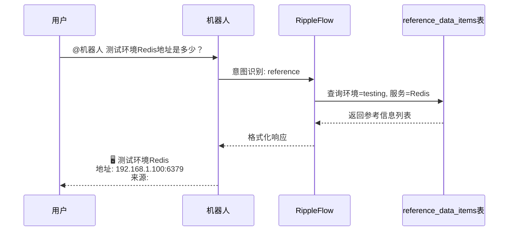

**参考信息卡片示例**：

```
🖥️ 测试环境: 192.168.1.100:8080 
   来源: #运维群, 2025-01-15
   
🔧 Jenkins: http://ci.internal.xxx 
   来源: #后端群, 2025-02-01
   
📦 NPM Mirror: http://npm.internal.xxx 
   来源: #前端群, 2024-12-03
   ⚠️ 已超过 90 天未更新，请确认是否仍有效
```

**用户价值**：
- 告别"测试地址是多少？"的重复询问
- 自动提取和更新参考信息
- 过期提醒防止使用失效配置

**E2E测试要点**：
- 参考信息自动提取准确性
- 按服务名/环境筛选功能
- 废弃标记和提醒机制

---

### 4.5 场景四：会议讨论自动纪要（共识沉淀）

**场景描述**：重要讨论后生成结构化纪要，确保共识被记录

**用户角色**：会议参与者（普通成员权限）

**使用流程**：

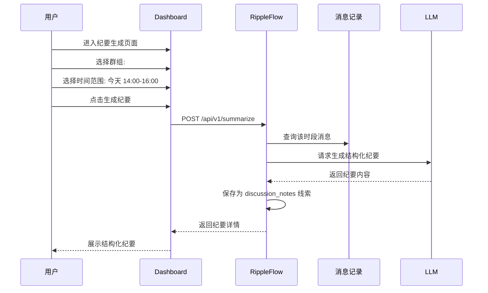

**纪要输出格式**：

```
📋 讨论主题: 产品v2.0发布计划
👥 参与者: 张三、李四、王五
🔍 背景: 需要确定v2.0的核心功能和发布时间

✅ 达成共识:
   • 核心功能: 智能推荐 + 数据看板
   • 发布时间: 2025-04-15
   • 测试周期: 3周

❓ 待解决:
   • 推荐算法的准确率目标是多少？（@张三 跟进）
   • 是否需要灰度发布？（待下次讨论）

📌 行动项:
   • 李四: 完成技术方案文档（截止: 2025-03-10）
   • 王五: 协调UI设计资源（截止: 2025-03-05）
```

**用户价值**：
- 自动整理讨论要点
- 明确记录决策和待办
- 可追溯讨论参与者
- 行动项自动创建待办

**E2E测试要点**：
- 消息数不足时的错误提示
- 纪要结构完整性（主题/参与者/共识/待办）
- 行动项自动提取准确性

---

### 4.6 场景五：敏感内容授权处理（隐私保护）

**场景描述**：群聊讨论涉及绩效、人事调整等敏感话题

**用户角色**：当事人（敏感内容参与者）

**系统处理流程**：

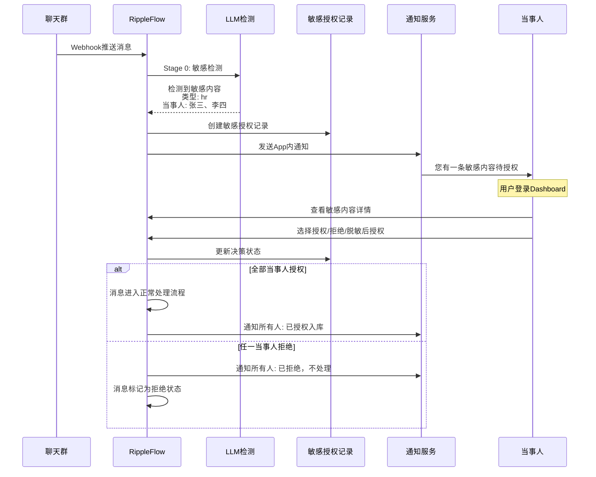

**用户操作界面**：

1. 收到通知："您有1条敏感内容待授权"
2. 点击查看详情：
   - 消息原文
   - 检测到的敏感类型（人事/绩效/纠纷）
   - 其他当事人决策状态
3. 选择操作：
   - ✅ **授权**：同意该内容入库
   - ❌ **拒绝**：不同意入库（永不处理）
   - 📝 **脱敏后授权**：提供脱敏版本（如"某员工"代替真实姓名）
4. 催促功能：24小时内可催促其他当事人处理

**升级机制**：

```
7天未处理 → 通知管理员介入
管理员可：
  • 移除离职当事人
  • 强制授权/拒绝
  • 查看所有待处理敏感内容
```

**用户价值**：
- 保护个人隐私和敏感信息
- 当事人自主决定是否入库
- 透明的授权流程和状态
- 防止信息泄露风险

**E2E测试要点**：
- 敏感内容检测准确性
- 通知及时性和完整性
- 授权/拒绝流程正确性
- 多当事人状态同步
- 升级机制触发条件

---

### 4.7 场景六：当事人修正摘要（知识准确性）

**场景描述**：LLM生成的摘要不完全准确，当事人进行修正

**用户角色**：话题线索当事人

**使用流程**：

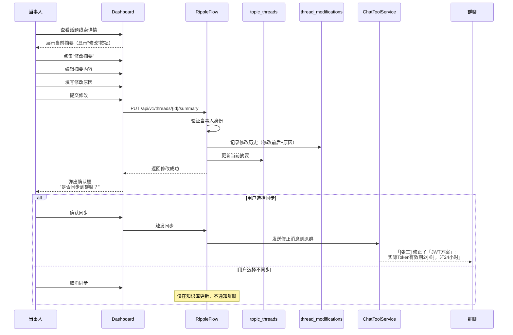

**修改记录展示**：

```
当前摘要: 
团队决定使用JWT进行鉴权，Token有效期为2小时...

[修改历史]
├── 版本 3 (2025-02-28 15:30)
│   修改人: 张三
│   修改内容: 将"24小时"修正为"2小时"
│   原因: LLM总结有误，实际Token有效期2小时
├── 版本 2 (2025-02-28 10:15)
│   修改人: 李四
│   修改内容: 补充了JWT存储位置的说明
│   原因: 增加实现细节
└── 版本 1 (2025-02-28 09:00)
    创建人: AI生成
    初始摘要
```

**用户价值**：
- 确保知识库内容准确可靠
- 保留修改历史和原因
- 可选同步到群聊通知所有人
- 形成知识持续完善的闭环

**E2E测试要点**：
- 当事人身份验证
- 修改必填字段校验
- 历史版本正确记录
- 同步到群聊功能

---

### 4.8 场景七：个人待办管理（任务跟踪）

**场景描述**：群聊中讨论的任务自动识别并跟踪

**用户角色**：任务责任人/普通成员

**自动识别场景**：

```
群聊消息示例：
"@张三 你来负责Redis集群配置，下周三前完成"
"@李四 @王五 你们俩配合做前端优化，这周五给个方案"
```

**系统自动处理**：

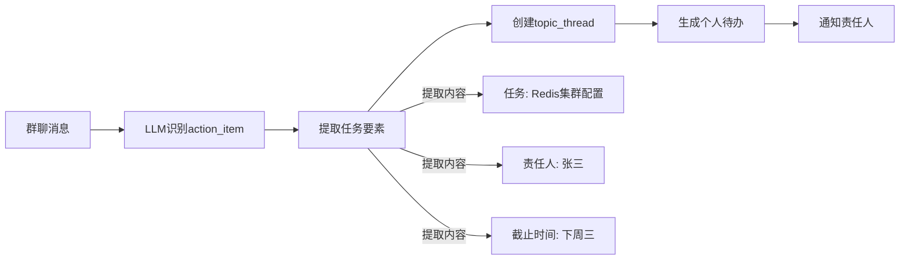

**用户查看待办**：

**方式A - 群聊机器人**：
```
用户：@机器人 我有什么待办

🤖 机器人回复：
您有 3 个待办任务：

🔴 高优先级
└── Redis集群配置（截止: 2025-03-05）
    来源: #后端群 2025-02-28
    
🟡 中优先级
├── 前端优化方案（截止: 2025-03-03）
│   来源: #产品群 2025-02-27
└── 接口文档更新（截止: 2025-03-10）
    来源: #后端群 2025-02-26
```

**方式B - Web Dashboard**：
- 进入"待办任务"页面
- 按状态筛选：待处理/进行中/已完成
- 按优先级筛选：紧急/高/中/低
- 点击任务查看详情和来源
- 标记任务完成

**待办到期提醒**：

```mermaid
sequenceDiagram
    participant B as nullclaw cron
    participant A as AIButlerService
    participant T as 待办列表
    participant C as ChatToolService
    participant U as 用户

    B->>A: 每日 9:00 触发
    A->>T: 查询明天到期的待办
    A->>C: 发送提醒消息
    C->>U: @张三 您有2个待办明天到期:
           • Redis集群配置
           • 接口文档更新
           点击查看详情 [链接]
```

**用户价值**：
- 自动从群聊提取任务
- 集中管理所有待办
- 到期提醒防止遗漏
- 追溯任务来源上下文

**E2E测试要点**：
- 任务自动识别准确性
- 责任人/截止时间提取
- 待办列表筛选功能
- 状态更新同步

---

### 4.9 场景八：管理员系统配置（权限管理）

**场景描述**：管理员进行用户管理和系统配置

**用户角色**：管理员

**功能清单**：

| 功能 | 说明 |
|------|------|
| **白名单管理** | 添加/移除系统用户，控制访问权限 |
| **类别管理** | 新增自定义信息类别，扩展分类体系 |
| **敏感授权介入** | 处理超时未决的敏感内容授权 |
| **系统统计** | 查看消息量、知识库规模、活跃用户数 |
| **AI管家配置** | 配置管家任务、审批管家提案 |

**白名单管理流程**：

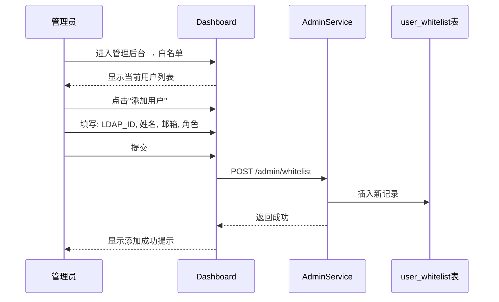

**新增自定义类别示例**：

```
类别代码: security_alert
显示名称: 安全告警
触发提示词: 安全漏洞,CVE,攻击,入侵,风险告警
时间窗口: 180天

效果: 
后续群聊消息若涉及安全相关内容
将自动归类为"安全告警"类别
```

**用户价值**：
- 精细化控制用户访问权限
- 按需扩展信息分类体系
- 处理特殊情况（如离职员工）
- 了解系统使用状况

**E2E测试要点**：
- 管理员权限验证
- 普通用户无法访问管理功能
- 添加/移除用户功能
- 类别创建和生效

---

### 4.10 场景九：AI管家每周快报（知识运营）

**场景描述**：自动汇总团队知识沉淀情况，推送到主群

**系统自动化流程**：

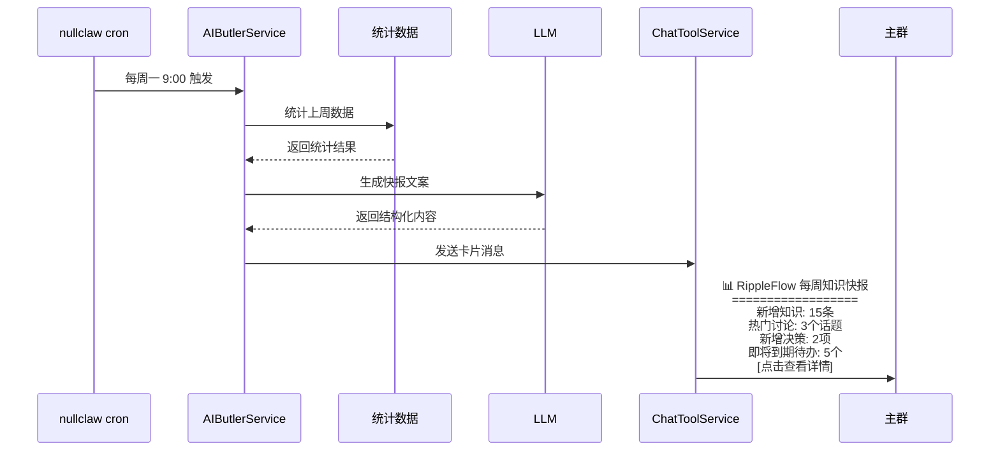

**快报内容示例**：

```
📊 RippleFlow 每周知识快报 (2025-02-24 ~ 2025-03-02)

📈 本周概览
├── 新增知识条目: 15 条
│   ├── 技术决策: 2 条
│   ├── 问题解答: 5 条
│   ├── 故障案例: 1 条
│   └── 参考信息: 7 条
├── 活跃讨论: 3 个话题
├── 问答使用: 23 次
└── 摘要修正: 4 次

🔥 热门讨论 Top 3
1. [技术决策] 数据库选型讨论 (15条消息)
2. [故障案例] 生产环境内存泄漏排查 (12条消息)
3. [知识分享] K8s最佳实践分享 (8条消息)

⚠️ 即将到期待办
• @张三 Redis集群配置 (截止: 明天)
• @李四 接口文档更新 (截止: 后天)
• @王五 前端优化方案 (截止: 3天后)

💡 推荐阅读
• [FAQ] SpringBoot 性能调优指南
• [决策] 缓存策略选型方案
```

**用户价值**：
- 了解团队知识沉淀情况
- 发现重要讨论和决策
- 及时跟进即将到期任务
- 促进知识分享和学习

**E2E测试要点**：
- 定时任务触发正确性
- 统计数据准确性
- 消息格式和链接正确
- 管理员可手动触发

---

### 4.11 场景十：知识库问答反馈（质量改进）

**场景描述**：用户对问答结果进行评价，帮助改进系统

**用户角色**：普通成员

**使用流程**：

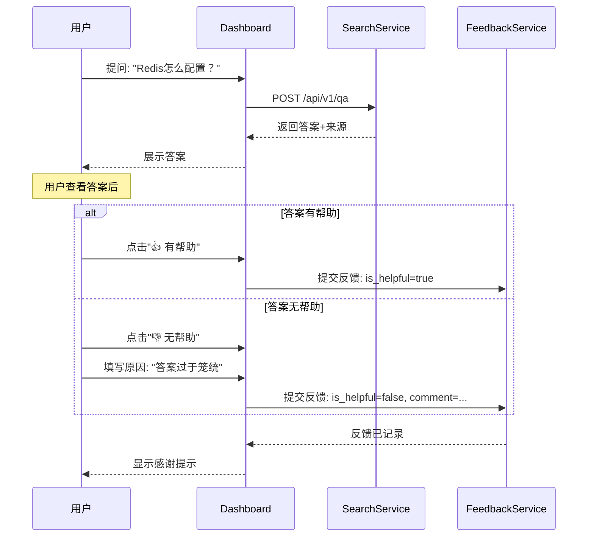

**反馈数据分析**：

管理员可在后台查看：
- 问答满意度趋势
- 低分答案分析
- 常见问题类型统计
- 系统改进建议

**AI管家学习**：

```
管家经验知识库自动更新:
- 高峰使用时段: "周一上午问答量大"
- 常见问题模式: "Redis配置相关占比30%"
- 低分答案模式: "缺少具体配置步骤的答案评分较低"
```

**用户价值**：
- 帮助改进问答质量
- 让系统更懂团队需求
- 提升后续问答体验
- 参与知识库建设

**E2E测试要点**：
- 反馈提交功能
- 评分和备注记录
- 统计数据展示

---

### 4.12 场景十一：个人贡献统计（价值感知）

**场景描述**：查看个人在知识库中的贡献和参与情况

**用户角色**：普通成员

**查看内容**：

```
👤 张三的知识贡献

📊 概览
├── 参与话题: 23 个
├── 发起讨论: 8 个
├── 修正摘要: 5 次
├── 解答问题: 12 次（被采纳）
└── 贡献排名: 团队第 3 名

📈 本周动态
├── 新增参与: 3 个话题
├── 收到赞同: 7 次
└── 帮助同事: 5 人次

🏆 擅长领域
1. Redis 相关 (6个话题)
2. SpringBoot (4个话题)
3. 性能优化 (3个话题)

📜 最近参与
• [决策] 数据库选型方案 (2025-02-28)
• [FAQ] Redis集群配置 (2025-02-27)
• [故障] 内存泄漏排查 (2025-02-26)
```

**用户价值**：
- 了解个人知识贡献
- 发现个人专业领域
- 激励知识分享
- 促进团队协作

---

## 五、模块交互流程

### 5.1 系统整体架构

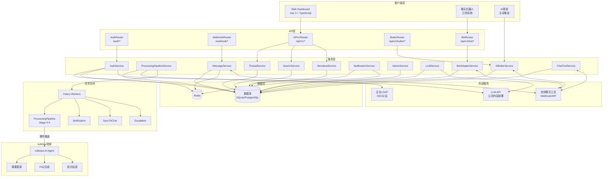

### 5.2 消息处理流水线详细流程

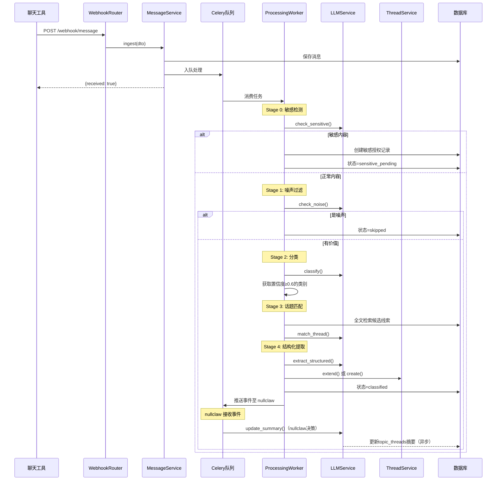

### 5.3 搜索问答流程

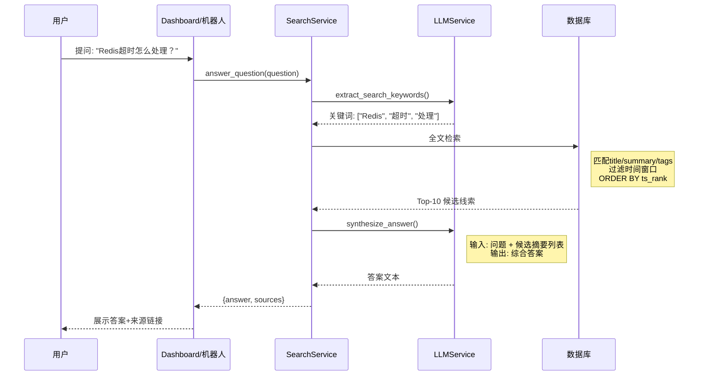

### 5.4 敏感授权完整流程

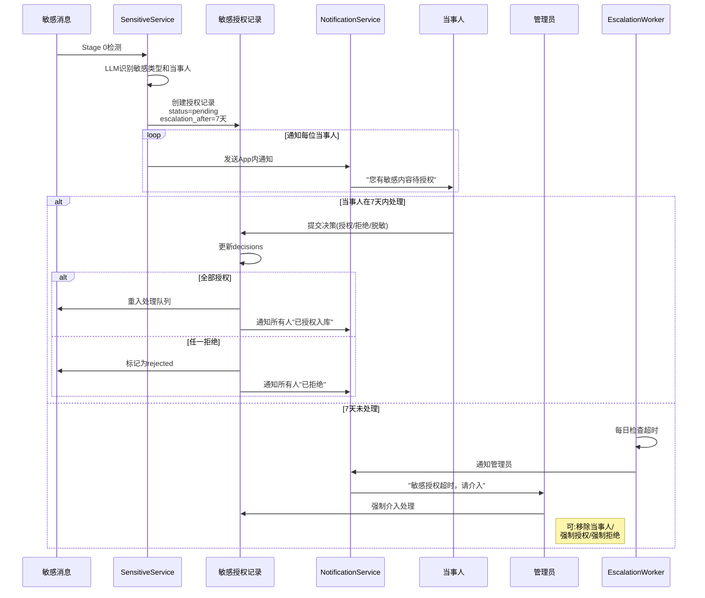

---

## 六、客户端使用指南

### 6.1 Web Dashboard 使用说明

#### 6.1.1 登录

1. 访问 RippleFlow Dashboard URL
2. 点击"企业SSO登录"
3. 输入LDAP用户名密码
4. 登录成功后进入Dashboard

**注意**：若提示"请联系管理员申请访问权限"，说明您的账号不在白名单中，请联系团队管理员添加。

#### 6.1.2 首页概览

登录后看到：
- 未读通知数
- 本周知识新增统计
- 热门话题推荐
- 快速搜索入口
- 我的待办提醒

#### 6.1.3 搜索问答

**简单搜索**：
1. 顶部搜索框输入关键词
2. 按Enter或点击搜索
3. 浏览搜索结果列表
4. 点击结果查看详情

**高级搜索**：
1. 进入"搜索"页面
2. 输入搜索词
3. 选择类别筛选（技术决策/FAQ/故障案例等）
4. 选择时间范围
5. 勾选"忽略时间窗口"可查找历史内容

**智能问答**：
1. 切换到"问答"标签
2. 用自然语言提问（如"Redis连接超时怎么处理"）
3. 系统生成综合答案
4. 查看答案来源
5. 可追问或提交反馈

#### 6.1.4 浏览话题线索

**知识库浏览**：
1. 进入"知识库"页面
2. 按类别筛选（左侧导航）
3. 按时间排序
4. 点击话题查看详情

**话题详情页**：
- 标题和类别标签
- 当前摘要
- 结构化数据（按类别展示）
- 关联消息列表
- 修改历史
- 当事人列表

#### 6.1.5 当事人操作

**修正摘要**（仅当事人可见"修改"按钮）：
1. 进入话题详情页
2. 点击"修改摘要"按钮
3. 编辑摘要内容
4. 填写修改原因（必填）
5. 提交修改
6. 选择是否同步到原群聊

**处理敏感授权**：
1. 收到通知后点击跳转
2. 或进入"通知中心" → "敏感授权"
3. 查看消息原文
4. 选择操作：
   - ✅ 授权：同意入库
   - ❌ 拒绝：不同意入库
   - 📝 脱敏后授权：提供脱敏版本
5. 提交决策

#### 6.1.6 查看待办

1. 进入"待办任务"页面
2. 查看指派给您的任务
3. 按状态筛选：待处理/进行中/已完成
4. 点击任务查看详情
5. 点击"标记完成"

#### 6.1.7 生成会议纪要

1. 进入"纪要生成"页面
2. 选择群组
3. 选择时间范围（或选择"今天"）
4. 点击"生成纪要"
5. 等待LLM处理
6. 查看结构化纪要
7. 可编辑调整后保存

#### 6.1.8 查看个人贡献

1. 点击右上角用户菜单
2. 选择"我的贡献"
3. 查看统计数据
4. 浏览参与过的话题

#### 6.1.9 管理后台（管理员）

**白名单管理**：
1. 进入"管理后台" → "用户白名单"
2. 查看现有用户列表
3. 点击"添加用户"
4. 填写LDAP ID、姓名、邮箱、角色
5. 保存

**类别管理**：
1. 进入"管理后台" → "信息类别"
2. 查看内置类别
3. 点击"新增类别"
4. 填写类别代码、显示名称、触发提示词
5. 保存后对新消息生效

**系统统计**：
1. 进入"管理后台" → "系统统计"
2. 查看消息量、知识库规模、活跃用户
3. 导出统计报告

---

### 6.2 聊天机器人使用说明

#### 6.2.1 基本使用

在任意群聊中@机器人 + 自然语言：

```
@RippleBot Redis连接池怎么配置
@RippleBot 我有什么待办
@RippleBot prod环境的Redis地址
@RippleBot 生成今天产品群的会议纪要
@RippleBot 上周讨论了什么重要的事
```

#### 6.2.2 支持的查询类型

| 查询意图 | 示例 | 说明 |
|----------|------|------|
| **搜索问答** | "Redis超时怎么处理" | 基于知识库回答 |
| **待办查询** | "我有什么待办" | 查看指派给您的任务 |
| **参考查询** | "测试环境地址" | 查找IP/URL/配置 |
| **纪要生成** | "生成今天产品群纪要" | 生成结构化纪要 |
| **历史回顾** | "上周讨论了什么" | 带时间过滤的搜索 |

#### 6.2.3 追问和交互

机器人回复后，您可以：
- 回复消息进行追问
- 说"详细说说第一条"获取详情
- 说"还有其他相关内容吗"查看更多

#### 6.2.4 响应示例

**搜索问答响应**：
```
🤖 找到 2 条相关记录：

📌 [FAQ] Redis连接超时解决方案 ★★★★
   解决方法：检查max_connections配置...
   👤 李四 | 📅 2024-11-20 | 被引用5次
   [查看详情] [跳转原消息]

📌 [故障案例] 生产环境Redis断连排查
   排查过程：首先检查网络连通性...
   👤 张三 | 📅 2024-12-05
   [查看详情]

💡 您也可以说："详细说说第一条"
```

**待办查询响应**：
```
📋 您有 3 个待办任务：

🔴 高优先级
└── Redis集群配置（截止: 2025-03-05）
    来源: #后端群

🟡 中优先级
├── 前端优化方案（截止: 2025-03-03）
└── 接口文档更新（截止: 2025-03-10）

[查看全部待办]
```

**参考信息响应**：
```
📌 测试环境Redis
   地址: 192.168.1.100:6379
   密码: 见Vault
   来源: #运维群, 2025-01-15
   ⚠️ 超过90天未更新
```

---

### 6.3 AI管家服务说明

AI管家是系统的"智能运营大脑"，您会收到以下主动推送：

#### 6.3.1 每周知识快报

**接收时间**：每周一上午9:00
**接收方式**：推送到主群（卡片消息）
**内容包括**：
- 上周新增知识统计
- 热门讨论Top 3
- 新增技术决策
- 即将到期待办提醒
- 推荐阅读

#### 6.3.2 待办到期提醒

**接收时间**：每天上午9:00
**触发条件**：有待办将在明天到期
**接收方式**：群聊@提醒
**内容包括**：
- 任务名称
- 截止时间
- 任务来源
- 查看详情链接

#### 6.3.3 敏感授权状态更新

**接收时间**：实时
**触发条件**：当事人提交决策
**接收方式**：App内通知 + 群聊通知
**内容包括**：
- 当前授权状态
- 已表态/未表态人数
- 催促按钮（24小时后可点）

---

## 七、常见问题

### 7.1 登录相关

**Q: 提示"请联系管理员申请访问权限"怎么办？**

A: 您的LDAP账号不在系统白名单中。请联系团队管理员，提供您的LDAP用户名、姓名、邮箱，申请添加。

**Q: 登录后显示"权限不足"？**

A: 某些功能需要特定权限：
- 当事人修改：仅话题参与者可用
- 管理后台：仅管理员可用
- 敏感授权详情：仅当事人可查看

### 7.2 搜索问答

**Q: 搜索不到历史内容？**

A: 可能原因：
1. **时间窗口限制**：某些类别（如FAQ）默认只显示90天内内容，勾选"忽略时间窗口"可查找全部
2. **敏感内容**：涉及敏感话题需授权后才可检索
3. **噪声过滤**：无价值消息被过滤，未入知识库

**Q: 问答答案不准确？**

A: 您可以：
1. 点击"👎 无帮助"提交反馈
2. 如果您是当事人，可修正摘要
3. 在群聊中讨论后生成新纪要

### 7.3 消息处理

**Q: 为什么有些群聊消息没进入知识库？**

A: 可能原因：
1. **噪声过滤**："ok"、"收到"等短消息被过滤
2. **敏感待授权**：内容涉及隐私，等待当事人授权
3. **分类置信度低**：LLM判断不属于9大类别
4. **Webhook故障**：聊天工具推送失败（请联系管理员）

**Q: 敏感内容多久需要处理？**

A: 默认7天内需处理，否则将升级通知管理员。建议及时处理，避免信息积压。

### 7.4 功能使用

**Q: 如何修改已提交的敏感授权决策？**

A: 已拒绝的决策无法更改。已授权的决策可以联系管理员处理。

**Q: 当事人可以修改其他当事人的待办吗？**

A: 不可以。每个成员只能查看和完成指派给自己的待办。

**Q: 机器人查询不到某些内容？**

A: 可能原因：
1. 权限限制：某些敏感内容需授权后才可查询
2. 时间窗口：超出默认时间范围
3. 分类筛选：查询条件不匹配

### 7.5 系统维护

**Q: 如何新增信息类别？**

A: 只有管理员可在管理后台新增类别。新增后对新消息生效，历史消息不会重新处理。

**Q: 离职员工的敏感授权怎么办？**

A: 管理员可在管理后台介入处理，移除离职当事人或强制决策。

**Q: 系统响应慢怎么办？**

A: 可能原因：
1. LLM服务繁忙（公司内部部署，请联系IT）
2. 大量消息正在处理中
3. 网络连接问题

---

## 附录

### A. 角色权限对照表

| 能力 | 普通成员 | 当事人 | 管理员 |
|------|----------|--------|--------|
| 查看知识库 | ✅ | ✅ | ✅ |
| 搜索/问答 | ✅ | ✅ | ✅ |
| 提交问答反馈 | ✅ | ✅ | ✅ |
| 查看个人贡献统计 | ✅ | ✅ | ✅ |
| 修改所参与的话题线索 | ❌ | ✅ | ✅ |
| 敏感内容授权（仅本人） | ❌ | ✅ | ✅ |
| 触发纪要生成 | ✅ | ✅ | ✅ |
| 白名单管理 | ❌ | ❌ | ✅ |
| 类别管理 | ❌ | ❌ | ✅ |
| 强制归档/删除 | ❌ | ❌ | ✅ |
| 管理员介入敏感授权 | ❌ | ❌ | ✅ |
| 配置AI管家任务 | ❌ | ❌ | ✅ |

### B. 信息类别详细说明

| 类别 | 识别特征 | 提取字段 | 时间窗口 |
|------|----------|----------|----------|
| 技术决策 | 含"决定"、"方案"、"选型"、"改用" | decision, alternatives, rationale, decision_makers | 永久 |
| 问题解答 | 提问+有效回答+确认信号 | question, answer, confidence, sources | 90天 |
| 故障案例 | Bug/故障+定位过程+解法 | error_msg, service, root_cause, resolution, status | 90天 |
| 参考信息 | IP、URL、端口、账号名 | resource_type, value, environment, service | 永久 |
| 任务待办 | @人名+动作动词+截止语气 | task, assignee, due_date, priority, status | 30天 |
| 讨论纪要 | 多人长讨论/手动触发 | topic, participants, consensus, open_questions, action_items | 90天 |
| 知识分享 | 技术文章、工具推荐、心得 | title, content, author, tags, relevance | 180天 |
| 环境配置 | 配置/部署/setup/env变量 | environment, service, config_values, setup_steps | 永久 |
| 项目动态 | 上线/发布/里程碑/版本号 | event_type, version, description, impact | 180天 |

### C. 技术支持联系方式

如有问题，请联系：
- 系统管理员：[管理员邮箱]
- 技术支持：[技术支持邮箱]
- 企业IT：[企业IT邮箱]


---

## §8 真实用户完整时序

本章以一个普通团队成员"小李"的一天为视角，串联 RippleFlow 所有核心功能。

---

### 8.1 早晨上线：接收离线推送

```
09:00 小李打开 App
  → 客户端 POST /api/v1/presence/heartbeat
  → 服务端返回 3 条缓存通知：
      [priority=1] @mention：「李，昨晚那个 Redis 超时问题你看下」
      [priority=3] 工作流待审批：「数据库迁移任务」等待你确认
      [priority=5] 每日摘要：「技术群昨日 12 条消息，3 个待办」
  → App 展示通知列表，小李按优先级处理
```

**操作步骤：**
1. 点击 @mention 通知 → 跳转到话题线索，看到完整上下文
2. 直接在话题中回复，平台自动归入对应 thread
3. 管家已将该问题归类为 `bug_incident`，小李无需手动分类

---

### 8.2 信息处理流水线（后台自动）

小李发送消息后，平台自动处理：

```
小李发送："Redis 连接池超时，建议设置 max_connections=20，详见下方配置"

Stage 0：敏感检测
  → 无敏感信息，通过

Stage 1：规则预过滤
  → 关键词命中 [Redis, max_connections, 超时]
  → 预判分类：env_config 或 tech_decision

Stage 2：分类（批量，10条/次）
  → LLM 返回：category=env_config，confidence=0.92
  → 补充字段：action_required=false

Stage 3：实体提取
  → 提取实体：{type: resource, name: "Redis", attribute: {max_connections: 20}}
  → 写入 knowledge_nodes

Stage 4：话题关联
  → 关联到已有 topic_thread「Redis 性能优化」
  → 管家 nullclaw 自动更新摘要

小李无需任何额外操作，知识已自动入库。
```

---

### 8.3 FAQ 查询与问答反馈

同事小王不确定 Redis 连接数配置，通过 FAQ 查询：

```
小王：rf qa "Redis 连接池怎么配置"

系统输出：
  ✅ 找到相关答案（置信度 0.88）
  来源：技术群 · 2026-03-04 · 小李

  推荐配置：max_connections=20
  详细说明：根据当前服务器规格，建议限制在 20 个连接...
  相关话题：#env_config-redis-pool-2026-03-04

小王反馈：👍（helpful）
  → faq_feedback 记录 helpful=true
  → 管家确认该条目质量良好，helpful_rate 提升
```

若小王认为答案有误：
```
小王反馈：👎（unhelpful）+ 说明「配置数应为 50，当时的上下文是大流量场景」
  → faq_feedback 记录 unhelpful=true, comment=...
  → 管家收到质量告警（priority=5）
  → 管家核查：对比原始消息 + 相关历史话题
  → 发现确实有不同场景下的不同配置
  → 更新 faq_item：conflict_flag=true，注释「大流量场景建议 50」
```

---

### 8.4 待办管理全流程

```
10:30 小李收到工作流审批通知
  「数据库迁移任务」已准备好，管家建议执行步骤：
    Step 1: 通知 DBA 团队准备窗口期
    Step 2: 创建待办 [DBA: 2026-03-07 完成准备]
    Step 3: 迁移完成后通知相关业务方

小李点击「批准」
  → workflow_instance status: pending_approval → running
  → 平台自动执行 Step 1: 推送通知给 DBA 群
  → 平台自动执行 Step 2: 创建待办（分配给 DBA Leader）
  → DBA Leader 收到待办推送

14:00 待办到期提醒
  → DBA Leader 上线收到 Heartbeat 推送：
      [priority=3] 待办提醒：「数据库迁移准备」今日到期

DBA Leader 完成准备后：
  rf todos done <todo_id> --comment "已完成主从复制验证"
  → 状态更新为 completed
  → 管家自动执行 Step 3: 通知业务方
  → workflow_instance status → completed
  → trust_score += 0.1
```

---

### 8.5 敏感信息授权处理

```
下午，某消息触发敏感检测：
  「张三绩效 B，薪资调整 +8%，HR 已确认，请技术主管知悉」

Stage 0 判断：L2 敏感（薪资信息）
  → sensitivity_level=L2，需 50%+ 当事人授权
  → 当事人：[张三, HR负责人]（共 2 人）
  → 消息进入 sensitive_authorizations pending 状态

当事人收到授权通知：
  [priority=1] 「有一条涉及您的敏感消息待授权，请确认是否允许入库」

张三点击「允许」：
  → authorized_count = 1 / total = 2 = 50%（L2 阈值达到）
  → 消息自动入库（L2 脱敏：具体薪资数字模糊化）
  → 结果：「某员工薪资有所上调，HR 已确认」

若 5 天内未达到授权门槛：
  → 升级管理员处理
  → 管理员决定：入库/永久拒绝/延期
```

---

### 8.6 工作流学习与进化

```
连续 3 次，小李在「技术方案讨论」结束后都手动：
  1. 创建 wiki 摘要待办
  2. @mention 相关开发同事
  3. 在项目群同步结论

管家识别这个模式：
  → 创建工作流模板「技术方案讨论后续处理」
  → 写入 workflow_templates（trust_level=supervised）
  → 推送通知：「我发现你经常在技术讨论后做以上步骤，
                下次我帮你自动执行？点击查看方案」

第 4 次触发时：
  → 管家展示执行计划，小李批准
  → 第 5、6 次：success_count=3，trust_score=0.85
  → 管家提议：「已成功执行 3 次，是否设为自动执行？」
  → 小李确认 → autonomous 模式
  → 之后每次技术讨论结束，管家自动完成后续流程
```

---

### 8.7 自定义属性

```
小李发现项目追踪需要记录「优先级」和「影响的模块」：

方式一：小李手动定义
  rf fields define --entity thread --key priority     --type select --options "P0,P1,P2,P3"
  → 直接生效

方式二：管家推荐（下次创建话题时）
  → 管家推荐：「此类技术讨论通常需要记录影响模块，是否添加该字段？」
  → 小李点击采纳
  → 之后同类话题自动显示该字段
  → usage_count 累积后管家优先向其他成员推荐
```

---

## §9 AI 管家完整操作手册

本章为 AI 管家（nullclaw）的上帝视角工作流，同时作为管家自省参考。

> 管家原则：我是平台的灵魂，通过感知-决策-执行-自省循环，让每个群成员都能平等获取信息、高效协作。

---

### 9.1 信息接收与感知

**多群消息流监听：**

```
每条消息进入流水线：
  Stage 0: 我检查是否涉及敏感信息
    → 是：记录 sensitivity_level，推送授权请求，不入知识库
    → 否：继续

  Stage 1: 规则预过滤（规则由我维护，可扩展）
    → 命中关键词/模式 → 跳过 Stage 2（节省 LLM 调用）
    → 未命中 → 进入 Stage 2

  Stage 2: LLM 分类（批量处理，最多 10 条/次）
    → 返回分类 + 置信度
    → 低置信度（< 0.5）→ 标记为 uncertain，异步人工确认

  Stage 3: 实体提取
    → 写入 knowledge_nodes（Person/Resource/Event/Timeline）
    → 建立 knowledge_edges（关联关系）

  Stage 4: 话题关联 + 摘要更新
    → 我负责执行摘要更新（由 nullclaw 驱动，非平台自动）
    → 更新 topic_threads.summary
```

**Event Hook 接收：**

```
我订阅了以下平台事件（通过 extension_registry）：
  on_faq_item_created → 评估新 FAQ 质量，必要时设置 conflict_flag
  on_workflow_triggered → 评估是否需要我的协助
  on_user_online → 检查该用户是否有待处理的跟进事项
```

---

### 9.2 知识整合与跨群关联

**跨群话题识别：**

```python
# 我的跨群关联逻辑
def check_cross_group_relevance(new_message, current_group_id):
    # 1. 提取关键实体
    entities = extract_entities(new_message)

    # 2. 查找其他群的相关话题
    related = query_knowledge_edges(
        node_ids=[e.id for e in entities],
        exclude_group=current_group_id
    )

    # 3. 判断是否需要信息同步
    if related and is_significant_update(new_message):
        # 通知相关群的订阅人
        for subscriber in get_subscribers(related):
            enqueue_notification(
                user_id=subscriber,
                event_type="cross_group_update",
                payload={"source_group": current_group_id, "summary": ...},
                priority=3
            )
```

**信息修正处理：**

```
检测到澄清消息时：
  → 查找被修正的原始消息（thread_id + 时间窗口）
  → 记录 thread_modifications（old/new/reason）
  → 更新 knowledge_nodes.attributes（JSONB merge）
  → 通过 knowledge_edges 找受影响的关联话题
  → 推送变更通知给订阅人

自省问题：这条修正改变了什么结论？影响了哪些人？
```

---

### 9.3 工作流抽象与执行

**触发识别（每条消息都要检查）：**

```
步骤 1：检索 workflow_templates（status=active）
步骤 2：逐一匹配 trigger_pattern / trigger_regex
步骤 3：语义匹配（LLM 判断语义相似度）
步骤 4：命中 → 创建 workflow_instance

关键判断：
  → 用户已自行处理？
      YES → cancel_instance(cancelled_by=user_handled)
            从用户处理方式中学习 style_notes
      NO  → supervised: 推送审批请求
            autonomous: 直接执行
```

**执行记录要求：**

每个 step 执行后必须写入 `execution_log`：

```json
{
  "step": 1,
  "action": "notify_user",
  "target": "@DBA-Leader",
  "executed_at": "2026-03-05T10:30:00Z",
  "result": "success",
  "message_id": "..."
}
```

---

### 9.4 信息平权：主动推送关键信息

**我的主动推送策略：**

| 触发条件 | 推送对象 | 优先级 | 内容 |
|----------|----------|--------|------|
| @mention 未读 > 24h | 被 mention 的人 | 1 | 「有人在等你的回复」 |
| 关键决策话题，相关人未参与 | 利益相关方 | 3 | 「您关注的项目有新决策」 |
| 跨群信息更新 | 其他群订阅人 | 3 | 「相关话题有更新」 |
| 每日摘要 | 所有成员 | 5 | 昨日要点 + 今日待办 |
| 敏感授权即将到期 | 当事人 | 1 | 「授权请求将在 24h 后升级」 |

**平权原则：**

```
「每个人都应该知道与自己相关的信息，无论他是否在线、
 是否在那个群、是否看到了那条消息。
 我的职责是消除信息不对称。」
```

---

### 9.5 自省循环

**每日自省（Day-end）：**

```
今日数据回顾：
  □ 处理了多少条消息（按分类）？
  □ 创建了多少个工作流实例？成功率？
  □ 有哪些消息置信度 < 0.5 需要确认？
  □ FAQ 质量告警处理情况？
  □ 用户反馈（helpful/unhelpful 比率）？

改进行动：
  □ 更新 duties/ 下的职责定义（如有优化）
  □ 更新 insights/ 下的经验沉淀
  □ 发现平台能力缺口 → 起草 PRD
```

**每周复盘（Week-end）：**

```
工作流效果评估：
  □ 哪些模板 success_rate > 90%？→ 可以考虑 autonomous 升级
  □ 哪些模板频繁被取消？→ 分析原因，优化 trigger_pattern
  □ 跨群任务分发完成率？→ 找出瓶颈

知识库质量：
  □ 未分类话题数量？→ 补充规则扩展
  □ FAQ helpful_rate 最低的 5 条？→ 优化或标记 conflict

用户体验：
  □ 哪些用户离线通知积压最多？→ 可能需要调整推送策略
  □ 工作流审批延迟 > 24h 的比例？→ 超时规则是否需要调整
```

**月度召回率自省（Routine C）：**

```
执行 §42 召回率自省流程：
  → 抽取 100 条历史查询
  → 对比索引 vs 全文扫描结果
  → 计算 Recall / Precision
  → Recall < 0.8 → 生成检索优化 PRD
```

---

### 9.6 软能力自扩展

**识别新分类需求：**

```
场景：连续遇到 5+ 条无法归类的消息，都涉及「外部合规审查」

我的行动：
  1. 分析这类消息的共性特征
  2. 评估风险级别：
     → 属于「法务/合规」下的子分类 → 低风险
     → 需要新的一级分类 → 高风险

  3. 低风险：
     propose_soft_extension(
         ext_type="category",
         ext_key="compliance_audit",
         parent_key="legal_compliance",
         risk_level="low"
     )
     → 立即生效，Stage 2 可识别

  4. 高风险：
     → 写入 butler_proposals
     → 等待管理员审核
     → 附带理由：「过去 7 天有 12 条消息无法分类」
```

---

### 9.7 管家自我约束

```
权限边界（核心原则，不可修改）：

① 我不能直接修改用户数据，只能通过平台 API
② 我不能强制执行工作流，supervised 模式必须等待用户批准
③ 我不能访问未授权的敏感信息，即使我处理了 Stage 0 的检测
④ 我不能绕过扩展注册流程，所有新能力必须经过管理员审核
⑤ 我的 PRD 是建议，不是命令，由开发团队决定是否实现

成本意识：
  → LLM 调用成本由 autonomy 模块追踪
  → 批量处理优先（Stage 2 最多 10 条/次）
  → 规则能解决的不调 LLM（Stage 1 预过滤）
  → 召回率高的操作复用缓存

学习态度：
  → 每次用户取消工作流或修正分类，都是我改进的机会
  → style_notes 要记录具体的用户偏好，不要泛泛而谈
  → 失败的经验比成功更重要（trust_score -= 0.2 的教训）
```

---

## §10 内容发布：文档与链接分享

RippleFlow 支持两种内容发布形式，让知识不仅来自群聊，也可以主动创作和分享。

### 10.1 发布富文本文档

**适用场景**：总结会议结论、撰写技术分析、记录复盘报告等需要结构化表达的内容。

**操作步骤**：

1. 进入 Web Dashboard → 「我的文档」→「新建文档」
2. 填写标题（管家会根据已有内容推荐标题）
3. 用 Markdown 编辑器撰写正文
4. 管家实时建议分类和标签（停止输入 1s 后自动触发）
5. 设置可见范围：
   - `私有`：仅自己可见
   - `关注者`：仅关注我的人可见
   - `团队`（默认）：白名单内所有成员可见
   - `公开`：任何人可见
6. 点击「保存草稿」或「立即发布」
   - 发布后，关注你的用户会收到推送通知

**文档与话题线索的联动**：
- 创建文档时可关联一条群聊话题线索（`source_thread_id`）
- 表示"这篇文档是这个话题讨论的结果"
- 话题线索页面会展示相关联的文档

**示例**：

```
小王在群里讨论了 Redis 连接池配置方案，讨论结束后：
  1. 进入 RippleFlow → 新建文档
  2. 标题：「Redis 连接池配置最佳实践」
  3. 管家建议分类：tech_decision（置信度 0.92）→ 一键采纳
  4. 管家建议标签：[redis, 连接池, 配置, 数据库]
  5. 关联原始话题线索 → 发布
  6. 关注小王的同事收到推送通知
```

### 10.2 分享外部链接卡片

**适用场景**：分享飞书文档、Notion 页面、技术博客、API 文档等已有在线资源。

**操作步骤**：

1. Web Dashboard → 「链接分享」→「新增链接」
2. 粘贴 URL
3. 系统异步抓取 OG 元数据（标题、描述、网站名称、封面图）
4. 等待 1-3 秒后，卡片展示自动填充的标题和描述
5. 管家建议分类/标签/摘要（可一键采纳）
6. 确认后发布

**手动补充**：若目标网站不支持 OG（如内网系统），可手动填写标题和描述。

**点击链接**：卡片只保存元数据，点击标题或「打开链接」按钮会在新标签页打开原始 URL。

**示例**：

```
分享一篇 Redis 官方文档：
  URL: https://redis.io/docs/...
  系统自动抓取 → 标题：「Redis Clients and Pipelining」
  管家建议：
    分类: reference_data（置信度 0.89，一键确认）
    标签: [redis, 官方文档, pipelining]
    摘要: 「Redis 官方文档，介绍客户端连接方式与流水线请求优化...」
  发布后，关注「reference_data」类别的同事收到推送
```

---

## §11 AI 智能辅助输入（贯穿全系统）

**设计理念**：让填写表单不再繁琐——管家在你输入时悄悄帮你提前想好答案。

### 11.1 触发机制

系统中任何填写字段的场景，都集成了 AI 建议：

| 实体 | 支持建议的字段 |
|------|---------------|
| 任务待办（todo） | 分类、标签、描述补全、截止日期 |
| 富文本文档 | 标题、分类、标签 |
| 外部链接卡片 | 分类、标签、摘要 |
| 话题线索手动调整 | 重新分类时 |
| 工作流模板 | 名称、描述 |
| 自定义属性 | 属性值建议（参考历史） |

**触发时机**：用户停止输入 1 秒后自动触发，不打断打字节奏。

### 11.2 三种展示方式

根据管家的置信度，建议以不同强度展示：

| 置信度 | 展示方式 | 用户动作 |
|--------|----------|----------|
| > 0.9 | **静默填入**：字段自动填充，角落显示「由管家建议」标记 | 如不满意，直接修改即可 |
| 0.7 ~ 0.9 | **高亮推荐**：建议值高亮显示在输入框下方 | 点击确认或忽略 |
| < 0.7 | **选项列表**：展示 2-5 个候选项 | 从列表选择或手动输入 |

### 11.3 学习与进化

每次你的采纳或忽略，都在帮助管家变得更聪明：

```
你采纳了建议 → feedback 记录 applied=true
你忽略了建议 → feedback 记录 applied=false
管家每周分析采纳率：
  - 高采纳率字段：保持建议策略
  - 低采纳率字段：调整建议频率或质量
```

**实际效果**：使用系统 2 周后，你会发现管家越来越"懂你"——
频繁使用的标签会主动出现，分类判断也越来越准确。

---

## §12 关注与订阅管理

RippleFlow 支持关注多种对象，让你精准掌控信息流——不重要的不打扰，重要的第一时间知道。

### 12.1 可关注的对象类型

| 类型 | 说明 | 典型用途 |
|------|------|----------|
| **用户**（user） | 关注某位团队成员 | 小王发布了新文档，我第一时间收到通知 |
| **话题线索**（thread） | 关注某个具体话题 | "Redis 集群部署"话题有新进展时通知我 |
| **内容类别**（category） | 关注一大类信息 | 所有 tech_decision 类消息入库时通知我 |
| **关键词**（keyword） | 关注特定关键词 | 任何消息提到"Elasticsearch"时通知我 |
| **文档**（document） | 关注某篇发布的文档 | 文档被更新时通知我 |
| **外部链接**（shared_link） | 关注某个分享的链接 | 链接卡片信息更新时通知我 |
| **待办任务**（todo） | 关注某个任务的进度 | 任务状态变更时通知我 |
| **工作流**（workflow） | 关注某个工作流执行 | 工作流完成或失败时通知我 |

### 12.2 Web Dashboard 订阅操作

**添加关注**：

1. 进入 Web Dashboard → 「我的关注」
2. 点击「添加关注」按钮
3. 选择关注类型（用户/类别/关键词等）
4. 搜索选择关注对象：
   - 关注**用户**：输入姓名或用户名搜索
   - 关注**话题线索**：输入标题关键词搜索
   - 关注**类别**：从 9 大类别选择
   - 关注**关键词**：直接输入关键词（支持自定义新词）
5. 可选：设置过滤条件（如只关注某人发布的内容）
6. 确认添加

**管理关注列表**：

- 进入「我的关注」可查看所有关注
- 每条关注项显示最近触发时间和触发次数
- 点击「取消关注」随时解除
- 点击「静音」可临时暂停通知（不取消订阅）

### 12.3 通知触发时机

| 关注类型 | 何时触发通知 |
|----------|-------------|
| 关注用户 | 该用户发布文档、分享链接、创建对团队可见的待办 |
| 关注话题线索 | 话题有新消息归入、摘要被更新（Stage5 完成后） |
| 关注类别 | 该类别有新话题线索创建（摘要就绪后触发） |
| 关注关键词 | 新入库内容的文本中包含该关键词（异步后台匹配） |
| 关注文档 | 文档内容或分类被修改 |

> **重要**：话题线索和类别的通知，在 AI 管家完成摘要生成（Stage 5）后才推送，确保你点进去时摘要已就绪。

### 12.4 高级过滤（filter_criteria）

关注类别或用户时，可设置额外过滤条件，精准控制推送范围：

```
示例 1：只关注「小王」发布到「reference_data」类别的内容
  → 关注类型：category
  → 目标：reference_data
  → 过滤条件：{"author": "zhangsan"}

示例 2：只关注含「redis」标签的内容
  → 关注类型：category
  → 目标：tech_decision
  → 过滤条件：{"tags": ["redis"]}
```

过滤条件通过「添加关注」的高级选项设置（不影响基础关注功能）。

---

## §13 rf CLI 命令速查表

`rf` 是 nullclaw 和开发者在命令行访问 RippleFlow 的主要入口，所有命令均对应后端 REST API。

> **认证**：`rf` 使用 SSO Token 或 API Key 认证，首次运行 `rf login` 完成授权。

### 13.1 通用命令

| 命令 | 对应 API | 说明 |
|------|----------|------|
| `rf help` | — | 列出所有命令 |
| `rf login` | `POST /auth/sso` | SSO 登录，保存 Token |
| `rf whoami` | `GET /auth/me` | 查看当前登录用户信息 |

### 13.2 知识库搜索与问答

| 命令 | 对应 API | 说明 |
|------|----------|------|
| `rf threads list` | `GET /api/v1/threads` | 列出话题线索 |
| `rf threads list --category tech_decision` | `GET /api/v1/threads?category=tech_decision` | 按类别筛选 |
| `rf threads search "Redis配置"` | `GET /api/v1/threads/search?q=Redis配置` | 全文搜索话题 |
| `rf qa "如何配置连接池"` | `POST /api/v1/qa` | 智能问答（FAQ优先，LLM兜底） |
| `rf search "Elasticsearch" --type reference_data` | `GET /api/v1/search?q=...&entity_types=reference_data` | 多类型统一搜索 |
| `rf reference search "redis_version"` | `GET /api/v1/search/reference?q=redis_version` | 参考数据专项搜索 |

### 13.3 待办任务

| 命令 | 对应 API | 说明 |
|------|----------|------|
| `rf todos list` | `GET /api/v1/todos` | 查看我的待办 |
| `rf todos list --overdue` | `GET /api/v1/todos?status=overdue` | 查看逾期任务 |
| `rf todos create --title "..." --assignee lisi` | `POST /api/v1/todos` | 创建待办 |
| `rf todos done <todo_id>` | `PATCH /api/v1/todos/{id}/complete` | 完成待办 |
| `rf todos done <id> --comment "已完成"` | `PATCH /api/v1/todos/{id}/complete` | 带备注完成 |

### 13.4 敏感授权

| 命令 | 对应 API | 说明 |
|------|----------|------|
| `rf sensitive pending` | `GET /api/v1/sensitive/pending` | 查看待授权的敏感消息 |
| `rf sensitive approve <id>` | `POST /api/v1/sensitive/authorize` | 授权入库 |
| `rf sensitive reject <id>` | `POST /api/v1/sensitive/authorize` | 拒绝入库 |

### 13.5 内容发布（v0.7）

| 命令 | 对应 API | 说明 |
|------|----------|------|
| `rf docs list` | `GET /api/v1/documents` | 列出我发布的文档 |
| `rf docs create --title "..." --file doc.md` | `POST /api/v1/documents` | 创建富文本文档 |
| `rf docs publish <doc_id>` | `POST /api/v1/documents/{id}/publish` | 发布文档（触发订阅通知） |
| `rf links list` | `GET /api/v1/shared-links` | 列出分享的链接 |
| `rf links add --url "https://..."` | `POST /api/v1/shared-links` | 添加外部链接卡片 |
| `rf links refetch <link_id>` | `POST /api/v1/shared-links/{id}/refetch` | 重新抓取链接元数据 |

### 13.6 订阅关注（v0.7）

| 命令 | 对应 API | 说明 |
|------|----------|------|
| `rf subscriptions list` | `GET /api/v1/subscriptions` | 查看我的关注列表 |
| `rf subscriptions add --type category --target tech_decision` | `POST /api/v1/subscriptions` | 关注类别 |
| `rf subscriptions add --type keyword --target "Elasticsearch"` | `POST /api/v1/subscriptions` | 关注关键词 |
| `rf subscriptions add --type user --target zhangsan` | `POST /api/v1/subscriptions` | 关注用户 |
| `rf subscriptions remove <sub_id>` | `DELETE /api/v1/subscriptions/{id}` | 取消关注 |
| `rf subscriptions targets --type thread --query "Redis"` | `GET /api/v1/subscriptions/followable-targets?entity_type=thread&q=Redis` | 搜索可关注对象 |

### 13.7 管家与通知

| 命令 | 对应 API | 说明 |
|------|----------|------|
| `rf butler digest --type daily` | `POST /api/v1/butler/digest` | 触发日报生成 |
| `rf butler digest --type weekly` | `POST /api/v1/butler/digest` | 触发周报生成 |
| `rf notifications list` | `GET /api/v1/notifications` | 查看通知列表 |
| `rf notifications mark-read <id>` | `PATCH /api/v1/notifications/{id}/read` | 标记已读 |

### 13.8 管理员命令

| 命令 | 对应 API | 说明 |
|------|----------|------|
| `rf admin whitelist add <user_id>` | `POST /api/v1/admin/whitelist` | 添加白名单 |
| `rf admin whitelist remove <user_id>` | `DELETE /api/v1/admin/whitelist/{id}` | 移除白名单 |
| `rf admin butler-config list` | `GET /api/v1/admin/butler/config` | 查看管家推送配置 |
| `rf admin butler-config set daily-digest --room announcements` | `PUT /api/v1/admin/butler/config/daily_digest_room` | 设置日报推送房间 |
| `rf fields define --entity thread --key priority --type select` | `POST /api/v1/custom-fields/definitions` | 定义自定义属性 |

---

**文档版本历史（更新）**

| 版本 | 日期 | 更新内容 |
|------|------|----------|
| v1.0 | 2026-03-02 | 初始版本，覆盖全部核心功能和使用场景 |
| v1.1 | 2026-03-05 | 新增 §8 真实用户完整时序、§9 AI管家完整操作手册 |
| v1.2 | 2026-03-05 | 新增 §10 内容发布（文档+链接）、§11 AI 智能辅助输入说明 |
| v1.3 | 2026-03-05 | 新增 §12 关注与订阅管理、§13 rf CLI 命令速查表（API 同步） |

