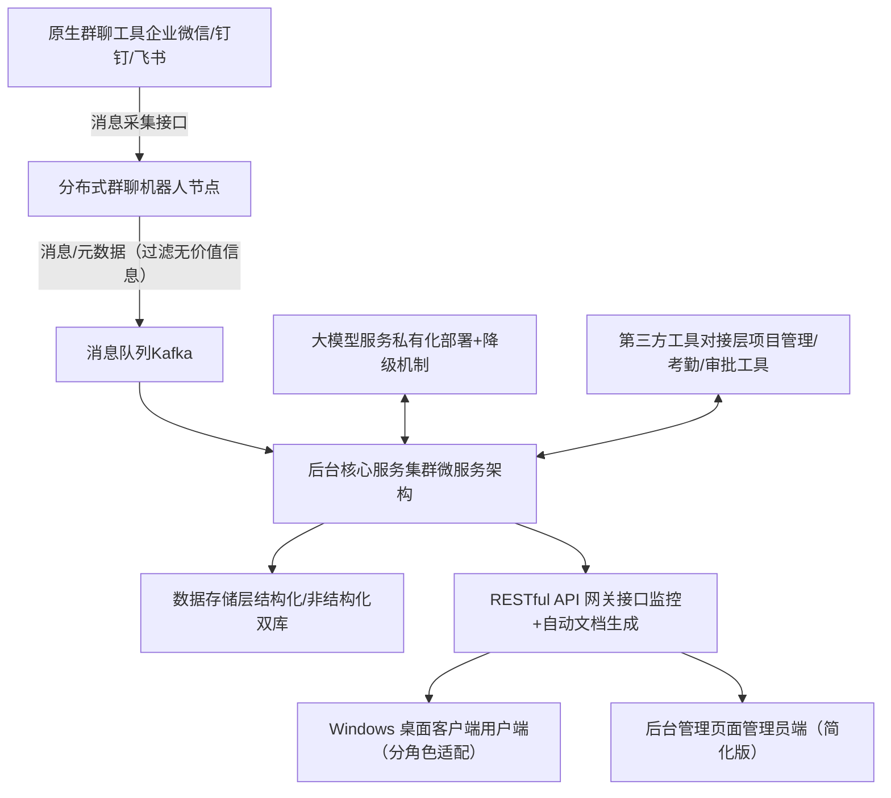
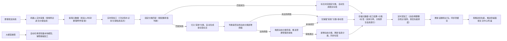

# 组织群聊信息智能加工系统 - 软件开发设计说明书（优化版）

# 1. 文档概述

## 1.1 文档目的

本说明书明确组织群聊信息智能加工系统的产品定位、核心功能、UI 设计、技术架构及实现方案，整合产品与UX优化建议，修正原有设计漏洞、优化落地可行性，作为系统开发、测试、部署的核心依据，确保系统贴合组织协作习惯、降低用户学习成本、实现高效落地。

## 1.2 产品定位

系统定位为**组织级群聊信息加工与协同中枢**，核心遵循“不替代、不干扰原生群聊”原则——原生信息始终保留在企业微信/钉钉/飞书等原有群聊工具中，系统仅通过分布式机器人采集群聊原生信息及元数据，经大模型加工后实现信息结构化、跨群整合、智能推荐、精准问答。

系统采用“后台仅保留管理页面+RESTful服务、Windows桌面端为用户核心交互入口”的实现方式，核心目标是解决组织内信息隔离、流通不畅、价值密度低、反复对齐成本高的问题，兼顾技术可行性与用户可接受度，实现“原生信息在群聊、价值信息在系统”的协作新格局。

# 2. 核心设计原则（优化版）

1. **原生信息不迁移**：群聊为信息生产/传播载体，系统仅采集、加工、关联原生信息，不存储完整原生信息（仅存索引），保留原生聊天语境，避免用户二次操作；

2. **轻量化交互+无干扰**：用户无额外操作成本，桌面端/机器人交互极简，机器人不主动刷屏、桌面端不强制弹窗，新增用户控制权，适配办公专注需求；

3. **角色分层适配**：基于普通员工、群管理员、组织管理员的差异化需求设计功能，避免“功能一刀切”，降低不同角色的操作成本；

4. **权限精细化**：基于 RBAC + 资源级权限管控，保证信息在可控范围内流动，同时优化权限继承逻辑，提升管理员效率；

5. **私有化部署+稳定性**：支持组织内网部署，保障数据安全与隐私；新增故障降级机制，避免系统瘫痪；

6. **扩展性+差异化适配**：微服务架构设计，支持新增群聊工具、加工能力的快速接入；支持小型团队与大型企业的差异化配置，适配不同规模组织需求；

7. **MVP 落地优先**：优先落地核心痛点解决方案，暂缓非必要功能，逐步迭代优化，提升系统推行成功率；

8. **灵活分类适配**：针对无法归类到固定分类的信息，采用“多标签+极简动态分类”结合模式，兼顾灵活性与易用性，避免信息冗余与分类混乱。

# 3. 系统架构设计（优化版）

## 3.1 整体架构


## 3.2 核心模块划分（优化版）

|模块分类|核心模块|功能描述（整合优化建议）|
|---|---|---|
|前端模块|Windows 桌面客户端|员工/群管理员的核心交互入口，分角色适配：普通员工聚焦关注中心、搜索问答、基础配置；群管理员新增群机器人配置入口；支持离线缓存、自动更新、静默模式，极简交互设计；支持多标签查看、自定义标签及极简动态分类操作。|
||后台管理页面|组织管理员的全局配置入口，简化界面布局，聚焦权限管控、加工规则配置、数据监控、批量操作，新增操作指引与系统健康监控，降低运维成本；支持全局标签体系管理、动态分类阈值配置及“其他”分类审核优化。|
|机器人模块|多渠道机器人适配层|适配不同群聊工具的机器人 SDK，实现消息采集、群内轻量反馈；支持“仅@唤醒”配置，可自定义无价值信息过滤规则，避免干扰群聊。|
|后台核心模块|消息采集服务|接收机器人采集的消息，做初步过滤、元数据提取，支持群管理员自定义过滤关键词，减少无效信息采集，降低算力成本。|
||大模型加工服务|调用大模型完成信息分类、总结、待办识别、推荐画像构建、问答整合；新增模型降级机制，故障时切换至轻量本地模型，保障基础功能可用；优化分类逻辑，支持固定分类匹配、多标签自动标注，及“其他”分类智能识别与动态分类触发判断。|
||信息存储服务|管理结构化/非结构化数据的存储、索引、同步，支持离线缓存数据管理，保障网络异常时的基础使用；支持标签数据、动态分类数据与原有分类数据的关联存储，确保检索精准性。|
||权限管控服务|统一权限校验，支持 RBAC + 资源级权限配置；优化权限继承逻辑（如部门负责人自动继承本部门群聊权限），支持权限申请与审批流程。|
||检索推荐服务|语义检索、智能推荐（人/消息/类别）、关注中心数据聚合；优化推荐算法，支持用户反馈调整，避免冗余推荐；支持按标签、固定分类、动态分类多维度检索与筛选。|
||跟踪提醒服务|待办跟踪、逾期提醒、关注内容更新推送；采用推送优先级机制，支持用户自定义提醒规则，避免推送拥堵。|
||跨群整合服务|跨群话题关联、信息整合、权限内的信息流转；支持差异化配置，小型团队可关闭该功能，降低配置成本；支持按标签、动态分类跨群整合相关信息。|
|基础设施模块|RESTful API 网关|统一接口管理、请求转发、限流、鉴权；新增接口文档自动生成功能，方便前后端对接，增加接口监控，及时发现异常。|
||消息队列|削峰填谷，保证消息采集的高可用，适配高并发场景。|
||数据存储层|结构化库（MySQL）+ 非结构化库（MongoDB）+ 检索引擎（Elasticsearch）+ 缓存（Redis）；支持向量数据库（Milvus）可选，提升检索精准度；新增标签、动态分类相关数据存储表，确保数据关联顺畅。|
||第三方对接层|对接组织现有项目管理（Jira、Trello）、考勤、审批工具，实现待办同步、信息整合，提升用户粘性。|
# 4. UI 呈现设计（优化版）

## 4.1 整体设计风格（优化版）

- 极简轻量化：避免冗余功能与界面元素，聚焦核心信息展示与操作，降低用户学习成本；

- 一致性：桌面端与管理页面的交互逻辑、视觉风格（按钮、颜色、字体）统一，避免用户适应成本；

- 适配性：桌面端支持 Windows 10/11（32位/64位），支持窗口化/置顶/最小化到托盘，适配不同办公场景；

- 低干扰：桌面端默认静默运行，仅在有重要提醒时触发托盘角标，支持静默模式配置；

- 引导性：新增首次使用引导、操作指引，异常场景有清晰提示，提升体验完整性；

- 灵活性：支持多标签查看、自定义标签及极简动态分类操作，适配无法归入固定分类的信息管理需求，操作便捷且不增加用户负担。

## 4.2 Windows 桌面客户端 UI 设计（核心优化）

### 4.2.1 核心布局（主窗口，简化版）

```Plain Text
┌─────────────────────────────────────────────────────────┐
│ 顶部导航栏：首页（关注中心）│ 搜索问答 │ 设置             │
├───────────────┬─────────────────────────────────────────┤
│ 左侧侧边栏    │ 右侧主内容区                             │
│ ┌───────────┐ │                                         │
│ │ 关注人    │ │ 1. 未读提醒区（高亮展示逾期待办/重要更新）│
│ │ 关注事    │ │ 2. 推荐内容区（推荐的人/消息/类别）      │
│ │ 关注类别  │ │ 3. 关注内容更新区（按时间/重要性排序）   │
│ │ 我的待办  │ │ 4. 标签/分类筛选区（固定分类+动态分类+标签）│
│ └───────────┘ │                                         │
├───────────────┴─────────────────────────────────────────┤
│ 底部状态栏：未读数 │ 同步状态                            │
└─────────────────────────────────────────────────────────┘
```

说明：删除原有冗余的“我的检索”“系统通知”，简化布局，聚焦核心功能入口，新增“标签/分类筛选区”，贴合Windows用户使用习惯，适配多标签与动态分类管理需求。

### 4.2.2 核心页面/组件（优化版）

1. **关注中心（首页）**

2. 未读提醒区：采用“红点+数字”组合，仅展示逾期待办、重要决策，点击直接跳转至详情，详情页突出“一键跳转原生群聊”按钮，方便用户查看完整语境；

3. 推荐内容区：每条推荐仅展示核心信息+10字内推荐理由，新增“一键关注/不感兴趣”按钮（无需进入详情页），“不感兴趣”点击后直接屏蔽该类推荐，无需二次确认；

4. 关注内容更新区：新增“一键筛选”按钮（未读/全部、按类型筛选），默认按“重要性+时间”排序，重要信息（决策、待办）标红，普通信息灰色，帮助用户快速聚焦重点；支持按固定分类、动态分类、标签多维度筛选；

5. 标签/分类筛选区：整合固定分类、动态分类（极简展示）、常用标签，支持点击筛选对应信息，标签可点击删除、新增，动态分类仅展示高频新增分类；

6. 新增“个人效率统计”：展示“本周节省找信息时间XX分钟”“本周解决问答XX个”，让用户直观感受提效价值。

7. **搜索问答页面**

8. 顶部搜索框：支持“回车提问、点击提问”双触发，输入时联想检索建议仅展示3条以内，优先匹配用户关注的人/事/类别、标签，避免遮挡视线；

9. 结果展示区：“精准答案”置顶，采用“加粗标题+简洁正文”，溯源链接标注“来自XX群/XX话题”，点击直接跳转至原生群聊；“相关信息”折叠展示，点击展开，避免结果混乱；每条信息标注所属固定分类/动态分类及标签，支持按标签、分类快速筛选；

10. 问答历史：整合至页面右侧，支持“一键重新提问、删除历史”，导出答案支持Excel/Word/纯文本三种格式，适配办公汇报场景；

11. 异常处理：搜索无结果时，提示“未找到相关信息，可尝试调整关键词，或关注相关类别、标签”，同时推荐相关关注对象、标签。

12. **设置页面（分角色适配）**

13. 按“功能分类”拆分：关注设置、通知设置、隐私设置、系统设置、标签与分类设置，每个分类仅保留核心配置项，所有配置项hover显示15字内简单说明；

14. 关注设置：仅保留“提醒频率、一键取消全部关注”，暂缓分组关注功能（一期不落地）；

15. 通知设置：支持推送优先级调整、静默模式开启/关闭，适配办公专注需求；

16. 系统设置：支持自动启动、同步频率、离线缓存配置，新增自动更新开关；

17. 标签与分类设置：普通员工可自定义个人标签、查看动态分类，可申请新增动态分类；群管理员可管理本群标签、审核本群“其他”分类信息；组织管理员可配置全局标签体系、动态分类阈值；

18. 群管理员专属：单独设置“群管理入口”，普通员工不可见，包含本群机器人规则配置、跨群共享审核功能，无需登录后台管理页。

19. **托盘组件（优化版）**

20. 静默运行时：托盘图标无角标，仅在有新提醒时显示“红点+数字”，点击直接打开主窗口；

21. 右键菜单：增加“快速检索”（无需打开主窗口，直接输入关键词）、“查看未读提醒”入口，提升操作效率；

22. 异常提醒：群管理员收到机器人采集失败、权限申请、“其他”分类信息过多提醒时，点击可直接跳转至对应配置/审批页面。

23. **首次使用引导与异常处理**

24. 首次使用：弹出3步引导（1. 关注常用的人/事/类别；2. 尝试搜索问答；3. 配置提醒规则、常用标签），引导完成后赠送新手礼包（优先体验智能推荐）；

25. 异常场景：
            

26. 网络异常：显示“网络断开，已切换至离线模式，可查看缓存信息”，网络恢复后自动同步；

27. 权限不足：提示“无权限访问该信息，可发起权限申请”，点击直接跳转至申请页面；

28. 机器人采集失败：群管理员收到托盘提醒，点击跳转至机器人配置页面；

29. “其他”分类信息过多：群管理员收到提醒，提示“当前‘其他’分类信息较多，可审核并新增动态分类或标签”。

## 4.3 后台管理页面 UI 设计（优化版）

- 布局：左侧功能菜单 + 右侧操作区，菜单按“权限配置、机器人配置、加工规则、标签与分类管理、数据监控、系统管理”排序，简洁清晰；

- 核心功能页（简化版）：
        

- 权限配置：角色管理、资源权限配置（话题/知识包可见范围），支持批量分配角色权限，优化权限继承配置；

- 机器人配置：群聊机器人规则配置（监听范围、加工粒度、过滤关键词），支持批量配置多个群聊，降低操作成本；

- 加工规则：大模型标签体系、总结模板、待办识别规则配置，支持组织自定义加工规则，贴合业务术语；优化分类规则，配置固定分类匹配阈值、“其他”分类触发条件、动态分类新增阈值；

- 标签与分类管理：全局标签体系管理（新增、删除、禁用），动态分类管理（审核、启用、删除），“其他”分类信息审核与批量处理，支持查看标签、分类的使用频率；

- 数据监控：采用“简洁图表+关键数据”展示，包括信息采集覆盖率、跨群整合率、待办完成率、用户活跃度、标签/分类使用频率、“其他”分类占比，突出异常数据（标红提醒），支持数据导出、时间范围筛选；新增“组织协作效率统计”，展示系统对组织的提效价值；

- 系统管理：私有化部署配置、数据备份/恢复（一键备份/恢复）、日志查看、系统健康监控（实时显示服务状态，异常自动提醒）。

- 操作指引：首次登录弹出3步核心配置指引，每个配置项增加帮助图标，点击查看详细操作说明；

- 兼容性：支持Chrome、Edge、Firefox主流浏览器，适配不同管理员使用习惯。

# 5. 技术栈选型（优化版）

## 5.1 前端技术栈

### 5.1.1 Windows 桌面客户端

- 开发框架：Electron（跨平台，适配Windows，支持Web技术栈，降低桌面端开发成本）；

- 前端基础：Vue 3 + TypeScript（组件化开发，类型安全）；

- UI 组件库：Element Plus（轻量化，适配桌面端交互，保持与管理页面风格统一）；

- 状态管理：Pinia（轻量，适配Vue 3）；

- 网络请求：Axios（封装RESTful API调用，处理请求/响应拦截，支持离线缓存逻辑）；

- 本地存储：Electron-store（桌面端本地缓存，存储用户配置/离线数据/检索历史、个人标签）；

- 通知能力：Electron Notification（系统托盘通知/弹窗提醒，支持优先级配置）；

- 新增能力：自动更新插件（后台检测更新，简易提示）、离线缓存管理插件、权限申请组件、标签与动态分类操作组件。

### 5.1.2 后台管理页面

- 开发框架：Vue 3 + TypeScript；

- UI 组件库：Element Plus（与桌面端风格统一）；

- 权限控制：Vue Router 路由守卫 + 后端权限校验（分角色展示菜单）；

- 数据可视化：ECharts（展示监控数据、统计报表，简洁易懂，支持标签/分类使用频率、“其他”分类占比展示）；

- 新增能力：批量操作组件、操作指引组件、系统健康监控组件、数据导出组件、标签与动态分类管理组件。

## 5.2 后台技术栈

### 5.2.1 核心服务（微服务）

- 开发语言：Java（Spring Boot + Spring Cloud）/ Go（可选，高性能，适配高并发场景）；

- 微服务框架：Spring Cloud Alibaba（服务注册/发现、配置中心、熔断降级，保障系统稳定性）；

- API 网关：Spring Cloud Gateway（路由转发、鉴权、限流，新增接口监控、自动文档生成功能）；

- 消息队列：Kafka（高吞吐，适配消息采集场景，削峰填谷）；

- 缓存：Redis（热点数据缓存、用户画像缓存、检索结果缓存，支持离线缓存数据同步、标签/分类数据缓存）；

- 任务调度：XXL-Job（定时深加工任务、数据备份任务、自动更新检测任务、“其他”分类信息统计与提醒任务）；

- 新增能力：大模型降级适配组件、第三方工具对接SDK、权限继承处理组件、标签生成与匹配组件、动态分类触发与管理组件。

### 5.2.2 数据存储

- 结构化数据库：MySQL 8.0（事务性强，存储用户、权限、话题、待办、标签、动态分类等结构化数据，新增标签表、动态分类表、信息-标签关联表）；

- 非结构化数据库：MongoDB（存储原始消息元数据、加工日志等非结构化数据）；

- 检索引擎：Elasticsearch 8.x（语义检索、向量检索，适配搜索问答场景，提升检索精准度；支持按标签、分类多维度检索）；

- 向量数据库：Milvus（可选，存储大模型生成的语义向量，进一步优化检索效果）；

- 新增能力：数据脱敏组件（处理敏感信息）、缓存同步组件（保障离线与在线数据一致）、标签与分类数据关联组件。

### 5.2.3 大模型集成

- 部署方式：私有化部署（如智谱清言/通义千问/文心一言私有化版本）；

- 集成方式：API 调用（封装统一的大模型调用接口，支持多模型切换、降级机制）；

- 辅助能力：

- ASR：科大讯飞/阿里云语音识别（语音转文字）；

- OCR：阿里云 OCR（图片/文件文字提取）；

- 文档解析：Apache POI + Tika（解析Word/Excel/PDF等文件，提取核心内容）；

- 新增：用户反馈收集组件（优化大模型加工精度）、自定义加工规则解析组件、标签自动生成组件、分类匹配与“其他”分类识别组件。

### 5.2.4 机器人适配

- 企业微信：企业微信机器人 API + 第三方应用开发（支持@唤醒、自定义过滤规则）；

- 钉钉：钉钉机器人 SDK + 自定义机器人开发（支持群内轻量反馈、采集规则配置）；

- 飞书：飞书开放平台 API + 机器人应用开发（适配飞书群聊特性，保障采集稳定性）。

### 5.3 部署与运维（优化版）

- 容器化：Docker + Kubernetes（K8s）（微服务容器化部署，支持水平扩展，适配不同规模组织）；

- 监控：Prometheus + Grafana（服务监控、性能监控、接口监控，实时展示系统健康状态，新增标签/分类相关数据监控）；

- 日志：ELK（Elasticsearch + Logstash + Kibana）（日志收集、分析，支持审计追溯）；

- CI/CD：Jenkins（自动化构建、部署，支持分阶段迭代部署）；

- 新增：数据备份/恢复自动化组件、系统异常告警组件（短信/邮件提醒管理员）、标签/分类数据备份组件。

# 6. 核心功能实现逻辑（优化版）

## 6.1 消息采集与加工流程（优化版）


## 6.2 搜索问答实现逻辑（优化版）

1. 用户在桌面端输入自然语言问题（支持回车/点击触发提问）；

2. API 网关接收请求，做权限校验后，转发至检索推荐服务；

3. 检索推荐服务将问题转为语义向量，在Elasticsearch中检索用户有权限访问的相关信息（含结构化/非结构化数据），支持按固定分类、动态分类、标签多维度检索；

4. 大模型加工服务整合检索结果，去重、结构化后生成精准答案，标注溯源链接（关联原生群聊索引）、所属分类及标签；

5. 结果返回至桌面端展示，“精准答案”置顶，“相关信息”折叠，支持一键跳转原生群聊、多轮追问、答案导出；

6. 若搜索无结果，触发异常提示，推荐相关关注对象、类别、标签，引导用户调整关键词。

## 6.3 智能推荐实现逻辑（优化版）

1. 后台实时采集用户行为数据（浏览/检索/关注/反馈、标签使用、分类筛选），构建用户协作画像（实时更新，支持用户清除画像）；

2. 基于协同过滤 + 语义相似度算法，结合用户画像生成推荐列表（人/消息/类别/话题/标签），按用户兴趣权重排序；

3. 经权限校验后，推送至桌面端关注中心，每条推荐附带精简推荐理由、所属分类及标签；

4. 用户点击“不感兴趣”后，实时反馈至后台，调整推荐算法，屏蔽该类推荐，避免冗余；

5. 推荐结果优先推送用户关注的人/事/类别、标签相关内容，兼顾推送优先级，避免干扰用户。

## 6.4 角色差异化功能实现逻辑（新增）

1. 普通员工：仅可见关注中心、搜索问答、基础设置、标签与分类设置（个人标签管理、动态分类查看、“其他”分类信息标注），无群管理、全局配置权限，可发起权限申请、动态分类申请；

2. 群管理员：在普通员工功能基础上，新增群机器人配置、跨群共享审核入口，可自定义本群采集过滤规则、管理本群标签、审核本群“其他”分类信息及动态分类申请；

3. 组织管理员：拥有全部权限，可配置全局权限、加工规则、系统参数、全局标签体系、动态分类阈值，查看全局数据监控与统计报表，进行批量操作，审核全局动态分类申请。

## 6.5 标签与分类管理实现逻辑（新增，针对无法归类信息）

1. 核心原则：以“多标签为主、极简动态分类为辅、‘其他’分类兜底”，避免分类冗余，兼顾灵活性与易用性，不增加用户与管理员负担；

2. 多标签实现：

3. 自动标注：大模型基于信息内容，自动生成3-5个核心标签（贴合组织业务术语，可在加工规则中配置标签生成规则）；

4. 手动标注：普通员工可给“其他”分类信息添加个人标签，群管理员可添加群级标签，组织管理员可添加全局标签；

5. 标签管理：支持标签删除、禁用，自动统计标签使用频率，高频标签优先展示，低频标签自动隐藏（不删除）；

6. 检索适配：支持按标签检索信息，标签与分类关联，检索时可组合分类与标签筛选，提升精准度。

7. 动态分类实现（极简管控，避免冗余）：

8. 触发条件：某类“其他”分类信息（按标签聚合）的数量达到组织管理员配置的阈值（如单标签关联信息≥10条），自动触发动态分类申请；

9. 审核流程：申请推送至群管理员（本群信息）或组织管理员（跨群信息），审核通过则新增动态分类，关联对应标签与信息；审核驳回则维持“其他”分类+标签状态；

10. 动态分类管控：仅允许新增“二级分类”（挂靠在固定一级分类下），不允许新增一级分类；组织管理员可定期清理低频动态分类（如3个月无新增信息），避免分类膨胀；

11. 展示逻辑：动态分类仅在筛选区极简展示，不与固定分类并列，避免干扰用户习惯。

12. “其他”分类兜底：

13. 仅作为临时兜底，不长期存储信息，群管理员需定期审核（如每周），将符合条件的信息迁移至动态分类或补充标签；

14. 系统自动统计“其他”分类占比，当占比超过阈值（如15%），触发管理员提醒，督促优化分类规则或新增动态分类；

15. 普通员工可对“其他”分类信息标注“建议分类”，反馈给管理员，提升分类优化效率。

# 7. 数据安全与权限管控（优化版）

## 7.1 数据安全

1. 私有化部署：所有数据存储在组织内网，不对外泄露，支持内网隔离部署；

2. 数据加密：传输层 HTTPS 加密，存储层敏感数据（财务、商业机密等）采用国密算法加密，操作日志全程加密存储；

3. 数据脱敏：大模型加工时自动脱敏手机号、身份证号、商业机密等敏感信息，避免传播泄露；

4. 日志审计：所有采集/加工/访问/操作行为可追溯，支持审计查询，保障数据安全可管控；标签、分类的新增、修改、删除操作全程留痕；

5. 数据备份与恢复：定时全量备份+增量备份，支持一键备份/恢复，配置数据保留期限，避免数据冗余与丢失；标签、动态分类数据同步备份；

6. 隐私保护：用户可在设置中清除画像数据、关闭推荐功能，行为数据仅用于系统推荐与优化，不对外泄露。

## 7.2 权限管控（优化版）

1. 基础权限：员工默认继承其所属所有群聊的权限，仅查看有权限的信息，无权限信息自动过滤；仅可查看、添加个人标签，查看动态分类；

2. 资源级权限：话题/知识包可配置“私有/本群可见/指定群可见/全局可见”，支持临时权限配置（如项目周期内可见）；标签、动态分类按群级/全局划分权限，普通员工不可修改群级/全局标签与动态分类；

3. 权限继承：部门负责人自动继承本部门所有群聊的权限，无需手动配置，提升管理员效率；

4. 权限申请与审批：员工可发起权限申请、动态分类申请，申请直达该信息的权限管理员，管理员在桌面端/管理页即可审批，审批通过后自动赋予临时/永久权限；

5. 角色权限：按普通员工、群管理员、组织管理员分层配置权限，避免权限混淆，保障系统安全；群管理员仅可管理本群标签与动态分类申请，组织管理员拥有全局标签与分类管理权限。

# 8. 开发与部署计划（优化版，贴合MVP落地）

## 8.1 一期开发（1-2 个月，MVP核心版）

- 核心能力：消息采集（支持单一群聊工具，如企业微信）、实时轻加工（打标/待办识别）、关注中心（基础关注/跟踪）、基础搜索问答（简单总结/检索）；基础标签功能（自动标注+手动标注）、“其他”分类兜底；

- 前端：Windows桌面端核心页面（简化版，聚焦普通员工功能）、后台管理页面基础功能（权限配置、机器人配置、基础标签管理）；

- 技术重点：机器人采集、大模型基础加工、RESTful服务搭建、数据安全基础保障、基础标签生成与匹配；

- 适配：Windows 10/11（64位）、企业微信机器人、私有化部署基础环境。

## 8.2 二期开发（2-3 个月，扩展优化版）

- 扩展能力：跨群整合、智能推荐、多轮问答、待办跟踪与提醒、批量操作、第三方工具对接；完善标签体系（群级/全局标签）、动态分类功能（触发、审核、管理）、“其他”分类审核优化；

- 前端：桌面端角色差异化功能、UX优化（首次引导、异常处理、效率统计）、后台管理页面完善（数据监控、系统健康监控、标签与分类管理）；

- 技术重点：大模型降级机制、离线缓存、自动更新、多群聊工具适配、权限继承优化、标签与动态分类核心逻辑实现；

- 适配：Windows 10/11（32位/64位）、多群聊工具（钉钉/飞书）、不同规模组织差异化配置。

## 8.3 试点与推广

1. 试点部署：选择2-3个高频协作的跨部门项目群试点，仅开启核心功能，重点收集标签与分类相关反馈，优化标签生成精度、动态分类阈值；

2. 优化迭代：根据试点反馈，调整功能布局、加工规则、推荐算法、标签与分类逻辑，解决落地痛点；

3. 全局部署：容器化部署至组织内网，逐步推广至全组织，提供简易操作指南，重点说明标签使用、动态分类申请流程，降低推广成本；

4. 长期迭代：基于用户行为数据、业务需求变化，持续优化功能，新增价值可视化、业务流程深度融合、标签自动优化等能力。

# 9. 业务适配与价值提升（新增，整合优化建议）

## 9.1 差异化适配不同规模组织

1. 小型团队（<50人）：默认“简化模式”，关闭跨群整合、权限精细化配置等复杂功能，仅保留核心功能（消息采集、关注跟踪、基础搜索）；标签与分类简化，仅保留基础固定分类、个人标签，关闭动态分类功能，“其他”分类由群管理员简易管理，降低配置与使用成本；

2. 大型企业（>100人）：默认“完整模式”，开启所有功能，支持多部门、多项目群的权限隔离与跨群协同，适配复杂组织架构；支持自定义加工规则、全局标签体系、动态分类功能，精细化管理“其他”分类信息，提升信息分类精准度。

## 9.2 与组织现有协作流程融合

1. 项目管理工具对接：将群聊中识别的待办自动同步至Jira、Trello等项目管理工具，同步标签与分类信息，避免用户二次录入；

2. 考勤/审批工具对接：将群聊中的审批提醒、考勤通知整合至桌面端关注中心，标注对应分类与标签，实现一站式信息查看；

3. 自定义加工规则：组织可自定义待办识别关键词、标签体系、固定分类规则、动态分类阈值，贴合自身业务术语与协作习惯（如互联网公司的“迭代”“bug”，传统企业的“审批”“报表”）。

## 9.3 价值可视化提升

1. 个人层面：桌面端新增“个人效率统计”，展示本周节省找信息时间、解决问答数量，让用户直观感受提效价值；展示个人常用标签、关注分类，方便快速筛选；

2. 组织层面：后台管理页新增“组织协作效率统计”，展示跨群信息整合率、待办完成率提升情况，同时展示标签/分类使用频率、“其他”分类占比，让管理员看到系统对组织的价值，及时优化分类与标签体系，提升推广意愿。

# 10. 核心总结（优化版）

本系统通过“分布式机器人嵌入+中心化中枢管理”的形态设计，坚守“原生信息在群聊、系统仅做加工”的核心定位，整合产品与UX优化建议，解决了原有设计中落地困难、用户抵触、体验不佳的问题，同时强化了稳定性、差异化适配与业务融合能力；针对无法归入固定分类的信息，采用“多标签为主、极简动态分类为辅、‘其他’分类兜底”的模式，兼顾灵活性与易用性，避免分类冗余与信息混乱。

系统核心亮点：

1. 落地性强：遵循MVP原则，优先落地核心痛点解决方案，轻量化交互、无干扰设计，降低用户学习成本与推行门槛；标签与分类设计极简，不增加用户与管理员负担；

2. 体验优化：分角色适配功能，完善首次引导与异常处理，简化界面与操作，贴合Windows桌面端使用习惯；标签与动态分类操作便捷，适配无法归类信息的管理需求；

3. 技术可靠：微服务架构、大模型降级机制、数据安全保障，支持私有化部署与水平扩展，适配不同规模组织；标签与分类数据关联顺畅，检索精准度高；

4. 价值明确：通过信息加工、跨群整合、智能推荐、精准问答，提升组织协作效率，实现知识沉淀；通过灵活的标签与分类管理，解决信息分类盲区，提升信息利用率；同时通过价值可视化，让用户与管理员直观感受到系统价值。

最终实现组织内信息的“自然流动、精准管控、智能加工、高效沉淀”，让员工从“反复对齐信息、人工整理信息、跨群查找信息”的低效工作中解放出来，让系统真正融入组织协作流程，成为组织高效协作的智能信息中枢。
> （注：文档部分内容可能由 AI 生成）